# N3N Flow Platform - 設計開發規格文件

> 版本: 2.0.0
> 最後更新: 2026-01

---

## 重要項目
 - 永遠使用中文對話

## 目錄

1. [系統概述](#1-系統概述)
2. [技術棧](#2-技術棧)
3. [系統架構](#3-系統架構)
4. [資料庫設計](#4-資料庫設計)
5. [Redis 資料結構](#5-redis-資料結構)
6. [核心模組設計](#6-核心模組設計)
7. [API 規格](#7-api-規格)
8. [前端設計](#8-前端設計)
9. [元件 SDK 設計](#9-元件-sdk-設計)
10. [部署架構](#10-部署架構)
11. [監控與日誌](#11-監控與日誌)
12. [安全架構](#12-安全架構)
13. [認證管理](#13-認證管理)
14. [流程分享](#14-流程分享)
15. [外部服務整合](#15-外部服務整合)

---

## 1. 系統概述

### 1.1 專案目標

建立一個可視化流程編排平台，讓使用者能夠：
- 透過拖拉介面設計工作流程
- 註冊自定義元件（微服務）
- 執行流程並即時監控狀態
- 分析流程效能瓶頸

### 1.2 核心特性

| 特性 | 說明 |
|------|------|
| **可視化編輯** | React Flow 拖拉介面，匯出 JSON 格式流程定義 |
| **語言無關元件** | 元件可用任意語言開發，透過標準介面通訊 |
| **高效資料傳遞** | 僅傳遞 UUID，資料存放於 Redis |
| **並發控制** | 支援 allow/deny/queue/replace 四種模式 |
| **即時監控** | WebSocket 即時推送執行狀態 |
| **ELK 整合** | 集中式日誌與效能分析 |

### 1.3 系統邊界

```
┌─────────────────────────────────────────────────────────────────┐
│                      Flow Platform                               │
│  ┌─────────────────────────────────────────────────────────┐    │
│  │                    Platform Core                         │    │
│  │  • Flow Engine (流程引擎)                                │    │
│  │  • Registry (元件註冊)                                   │    │
│  │  • API Gateway                                          │    │
│  └─────────────────────────────────────────────────────────┘    │
│                              │                                   │
│                              ▼                                   │
│  ┌─────────────────────────────────────────────────────────┐    │
│  │                 Component Runtime                        │    │
│  │  • K8s 上的微服務群                                      │    │
│  │  • 透過 HTTP 與 Platform Core 通訊                       │    │
│  └─────────────────────────────────────────────────────────┘    │
└─────────────────────────────────────────────────────────────────┘
```

---

## 2. 技術棧

### 2.1 後端

| 元件 | 技術 | 版本 | 說明 |
|------|------|------|------|
| 語言 | Java | 21 | Virtual Threads 支援 |
| 框架 | Spring Boot | 3.2+ | WebFlux 可選 |
| 編譯 | GraalVM | 21+ | Native Image 加速啟動 |
| 快取 | Redis | 7.0+ | 資料流、狀態、鎖 |
| 資料庫 | PostgreSQL | 15+ | 流程定義、歷史記錄 |
| 訊息 | Redis Streams | - | 事件發布訂閱 |

### 2.2 前端

| 元件 | 技術 | 版本 |
|------|------|------|
| 框架 | React | 18+ |
| 語言 | TypeScript | 5.0+ |
| 流程圖 | React Flow | 11+ |
| 狀態管理 | Zustand | 4+ |
| UI 元件 | Ant Design | 5+ |
| HTTP | Axios | 1.6+ |
| WebSocket | native | - |

### 2.3 基礎設施

| 元件 | 技術 |
|------|------|
| 容器編排 | Kubernetes |
| 服務發現 | K8s Service |
| 日誌收集 | Filebeat |
| 日誌處理 | Logstash |
| 日誌儲存 | Elasticsearch |
| 日誌視覺化 | Kibana |
| 監控指標 | Prometheus |
| 監控視覺化 | Grafana |

---

## 3. 系統架構

### 3.1 整體架構圖

```
                                    ┌─────────────────┐
                                    │   Flow Editor   │
                                    │    (React)      │
                                    └────────┬────────┘
                                             │ HTTP/WS
                                             ▼
┌────────────────────────────────────────────────────────────────────────┐
│                            API Gateway                                  │
│                         (Spring Boot)                                   │
│  ┌──────────────┐  ┌──────────────┐  ┌──────────────┐  ┌────────────┐ │
│  │   Flow API   │  │ Execution API│  │ Registry API │  │ WebSocket  │ │
│  └──────────────┘  └──────────────┘  └──────────────┘  └────────────┘ │
└───────────┬────────────────┬─────────────────┬─────────────┬──────────┘
            │                │                 │             │
            ▼                ▼                 ▼             │
┌───────────────────────────────────────────────────────────┐│
│                     Flow Engine                           ││
│  ┌─────────────┐  ┌─────────────┐  ┌─────────────────┐   ││
│  │ DAG Parser  │  │  Scheduler  │  │ State Manager   │   ││
│  └─────────────┘  └─────────────┘  └─────────────────┘   ││
│  ┌─────────────┐  ┌─────────────┐  ┌─────────────────┐   ││
│  │Concurrency  │  │  Executor   │  │ Event Publisher │◀──┘│
│  │  Manager    │  │             │  │                 │    │
│  └─────────────┘  └─────────────┘  └─────────────────┘    │
└───────────────────────────┬───────────────────────────────┘
                            │
            ┌───────────────┼───────────────┐
            ▼               ▼               ▼
     ┌───────────┐   ┌───────────┐   ┌───────────┐
     │   Redis   │   │ PostgreSQL│   │    K8s    │
     │           │   │           │   │  Cluster  │
     │ • 執行狀態 │   │ • 流程定義 │   │           │
     │ • 資料流   │   │ • 元件定義 │   │ ┌───────┐ │
     │ • 分散式鎖 │   │ • 執行歷史 │   │ │Comp A │ │
     └───────────┘   └───────────┘   │ ├───────┤ │
                                     │ │Comp B │ │
                                     │ ├───────┤ │
                                     │ │Comp C │ │
                                     │ └───────┘ │
                                     └───────────┘
```

### 3.2 模組職責

```
┌─────────────────────────────────────────────────────────────┐
│                        flow-platform                         │
├─────────────────────────────────────────────────────────────┤
│  flow-api          │ REST API、WebSocket、認證授權           │
│  flow-engine       │ 流程解析、調度執行、狀態管理            │
│  flow-registry     │ 元件 CRUD、K8s 部署、版本管理           │
│  flow-common       │ 共用模型、工具類、常數                  │
│  flow-sdk          │ 元件開發 SDK（多語言）                  │
└─────────────────────────────────────────────────────────────┘
```

### 3.3 執行流程時序圖


---

## 4. 資料庫設計

### 4.1 ER Diagram

```mermaid
erDiagram
    USER ||--o{ USER_ROLE : has
    USER ||--o{ REFRESH_TOKEN : has
    USER ||--o{ EMAIL_VERIFICATION : has
    USER ||--o{ AUDIT_LOG : generates
    USER ||--o{ FLOW : creates
    USER ||--o{ EXECUTION : triggers
    FLOW ||--o{ FLOW_VERSION : has
    FLOW_VERSION ||--o{ EXECUTION : triggers
    EXECUTION ||--o{ NODE_EXECUTION : contains
    COMPONENT ||--o{ COMPONENT_VERSION : has
    FLOW_VERSION }o--o{ COMPONENT_VERSION : uses

    USER {
        uuid id PK
        string email UK
        string password_hash
        string name
        string avatar_url
        string status
        boolean email_verified
        timestamp last_login_at
        integer login_attempts
        timestamp locked_until
        timestamp created_at
    }

    USER_ROLE {
        uuid id PK
        uuid user_id FK
        string role
        timestamp created_at
    }

    REFRESH_TOKEN {
        uuid id PK
        uuid user_id FK
        string token_hash UK
        string device_info
        string ip_address
        timestamp expires_at
        timestamp revoked_at
    }

    EMAIL_VERIFICATION {
        uuid id PK
        uuid user_id FK
        string token_hash UK
        string type
        timestamp expires_at
        timestamp used_at
    }

    AUDIT_LOG {
        uuid id PK
        uuid user_id FK
        string action
        string resource_type
        uuid resource_id
        string ip_address
        jsonb details
        timestamp created_at
    }

    FLOW {
        uuid id PK
        string name
        string description
        uuid created_by FK
        timestamp created_at
        timestamp updated_at
        boolean is_deleted
    }

    FLOW_VERSION {
        uuid id PK
        uuid flow_id FK
        string version
        jsonb definition
        jsonb settings
        string status
        timestamp created_at
        uuid created_by FK
    }

    EXECUTION {
        uuid id PK
        uuid flow_version_id FK
        string status
        jsonb trigger_input
        jsonb trigger_context
        timestamp started_at
        timestamp completed_at
        integer duration_ms
        uuid triggered_by FK
        string cancel_reason
    }

    NODE_EXECUTION {
        uuid id PK
        uuid execution_id FK
        string node_id
        string component_name
        string component_version
        string status
        timestamp started_at
        timestamp completed_at
        integer duration_ms
        text error_message
        string worker_id
    }

    COMPONENT {
        uuid id PK
        string name UK
        string display_name
        string description
        string category
        uuid created_by FK
        timestamp created_at
        boolean is_deleted
    }

    COMPONENT_VERSION {
        uuid id PK
        uuid component_id FK
        string version
        string image
        jsonb interface_def
        jsonb config_schema
        jsonb resources
        string status
        timestamp created_at
    }
```



### 4.2 Table Schema

#### flows

```sql
CREATE TABLE flows (
    id              UUID PRIMARY KEY DEFAULT gen_random_uuid(),
    name            VARCHAR(255) NOT NULL,
    description     TEXT,
    created_by      VARCHAR(255) NOT NULL,
    created_at      TIMESTAMP WITH TIME ZONE DEFAULT NOW(),
    updated_at      TIMESTAMP WITH TIME ZONE DEFAULT NOW(),
    is_deleted      BOOLEAN DEFAULT FALSE,

    CONSTRAINT uk_flows_name UNIQUE (name) WHERE NOT is_deleted
);

CREATE INDEX idx_flows_created_by ON flows(created_by) WHERE NOT is_deleted;
```

#### flow_versions

```sql
CREATE TABLE flow_versions (
    id              UUID PRIMARY KEY DEFAULT gen_random_uuid(),
    flow_id         UUID NOT NULL REFERENCES flows(id),
    version         VARCHAR(50) NOT NULL,
    definition      JSONB NOT NULL,
    settings        JSONB NOT NULL DEFAULT '{}',
    status          VARCHAR(20) NOT NULL DEFAULT 'draft',
    created_at      TIMESTAMP WITH TIME ZONE DEFAULT NOW(),
    created_by      VARCHAR(255) NOT NULL,

    CONSTRAINT uk_flow_versions UNIQUE (flow_id, version),
    CONSTRAINT chk_flow_version_status CHECK (status IN ('draft', 'published', 'deprecated'))
);

CREATE INDEX idx_flow_versions_flow_id ON flow_versions(flow_id);

COMMENT ON COLUMN flow_versions.definition IS 'Flow JSON 定義，包含 nodes 和 edges';
COMMENT ON COLUMN flow_versions.settings IS '並發控制、超時設定等';
```

#### executions

```sql
CREATE TABLE executions (
    id                  UUID PRIMARY KEY,
    flow_version_id     UUID NOT NULL REFERENCES flow_versions(id),
    status              VARCHAR(20) NOT NULL DEFAULT 'pending',
    trigger_input       JSONB,
    trigger_context     JSONB,
    started_at          TIMESTAMP WITH TIME ZONE,
    completed_at        TIMESTAMP WITH TIME ZONE,
    duration_ms         INTEGER,
    triggered_by        VARCHAR(255),
    trigger_type        VARCHAR(50),
    cancel_reason       TEXT,
    cancelled_by        VARCHAR(255),
    cancelled_at        TIMESTAMP WITH TIME ZONE,

    CONSTRAINT chk_execution_status CHECK (
        status IN ('pending', 'running', 'completed', 'failed', 'cancelled', 'cancelling')
    )
);

CREATE INDEX idx_executions_flow_version ON executions(flow_version_id);
CREATE INDEX idx_executions_status ON executions(status);
CREATE INDEX idx_executions_started_at ON executions(started_at DESC);

-- 分區表（按月分區，用於大量執行記錄）
-- CREATE TABLE executions (...) PARTITION BY RANGE (started_at);
```

#### node_executions

```sql
CREATE TABLE node_executions (
    id                  UUID PRIMARY KEY DEFAULT gen_random_uuid(),
    execution_id        UUID NOT NULL REFERENCES executions(id),
    node_id             VARCHAR(100) NOT NULL,
    component_name      VARCHAR(255) NOT NULL,
    component_version   VARCHAR(50) NOT NULL,
    status              VARCHAR(20) NOT NULL DEFAULT 'pending',
    started_at          TIMESTAMP WITH TIME ZONE,
    completed_at        TIMESTAMP WITH TIME ZONE,
    duration_ms         INTEGER,
    error_message       TEXT,
    error_stack         TEXT,
    worker_id           VARCHAR(255),
    retry_count         INTEGER DEFAULT 0,

    CONSTRAINT uk_node_execution UNIQUE (execution_id, node_id),
    CONSTRAINT chk_node_status CHECK (
        status IN ('pending', 'running', 'completed', 'failed', 'cancelled', 'skipped')
    )
);

CREATE INDEX idx_node_executions_execution ON node_executions(execution_id);
CREATE INDEX idx_node_executions_component ON node_executions(component_name);
```

#### components

```sql
CREATE TABLE components (
    id              UUID PRIMARY KEY DEFAULT gen_random_uuid(),
    name            VARCHAR(255) NOT NULL,
    display_name    VARCHAR(255) NOT NULL,
    description     TEXT,
    category        VARCHAR(100),
    icon            VARCHAR(255),
    created_by      VARCHAR(255) NOT NULL,
    created_at      TIMESTAMP WITH TIME ZONE DEFAULT NOW(),
    updated_at      TIMESTAMP WITH TIME ZONE DEFAULT NOW(),
    is_deleted      BOOLEAN DEFAULT FALSE,

    CONSTRAINT uk_components_name UNIQUE (name) WHERE NOT is_deleted
);

CREATE INDEX idx_components_category ON components(category) WHERE NOT is_deleted;
```

#### component_versions

```sql
CREATE TABLE component_versions (
    id              UUID PRIMARY KEY DEFAULT gen_random_uuid(),
    component_id    UUID NOT NULL REFERENCES components(id),
    version         VARCHAR(50) NOT NULL,
    image           VARCHAR(500) NOT NULL,
    interface_def   JSONB NOT NULL,
    config_schema   JSONB,
    resources       JSONB NOT NULL DEFAULT '{"memory": "256Mi", "cpu": "200m"}',
    health_check    JSONB,
    status          VARCHAR(20) NOT NULL DEFAULT 'active',
    created_at      TIMESTAMP WITH TIME ZONE DEFAULT NOW(),
    created_by      VARCHAR(255) NOT NULL,

    CONSTRAINT uk_component_versions UNIQUE (component_id, version),
    CONSTRAINT chk_component_version_status CHECK (status IN ('active', 'deprecated', 'disabled'))
);

COMMENT ON COLUMN component_versions.interface_def IS '輸入輸出介面定義';
COMMENT ON COLUMN component_versions.config_schema IS '元件配置的 JSON Schema';
COMMENT ON COLUMN component_versions.resources IS 'K8s 資源配置';
```

#### external_services

外部服務註冊表，用於整合第三方 API 服務。

```sql
CREATE TABLE external_services (
    id              UUID PRIMARY KEY DEFAULT gen_random_uuid(),
    name            VARCHAR(255) NOT NULL,
    display_name    VARCHAR(255) NOT NULL,
    description     TEXT,
    base_url        VARCHAR(500) NOT NULL,
    protocol        VARCHAR(20) NOT NULL DEFAULT 'REST',
    schema_url      VARCHAR(500),
    auth_type       VARCHAR(50),
    auth_config     JSONB,
    health_check    JSONB,
    status          VARCHAR(20) NOT NULL DEFAULT 'active',
    created_by      UUID NOT NULL REFERENCES users(id),
    created_at      TIMESTAMP WITH TIME ZONE DEFAULT NOW(),
    updated_at      TIMESTAMP WITH TIME ZONE DEFAULT NOW(),
    is_deleted      BOOLEAN DEFAULT FALSE,

    CONSTRAINT uk_external_services_name UNIQUE (name) WHERE NOT is_deleted,
    CONSTRAINT chk_external_service_protocol CHECK (protocol IN ('REST', 'GraphQL', 'gRPC')),
    CONSTRAINT chk_external_service_status CHECK (status IN ('active', 'inactive', 'error'))
);

CREATE INDEX idx_external_services_status ON external_services(status) WHERE NOT is_deleted;

COMMENT ON COLUMN external_services.base_url IS '服務基礎 URL，例如 http://user-service:8080';
COMMENT ON COLUMN external_services.protocol IS '協議類型：REST, GraphQL, gRPC';
COMMENT ON COLUMN external_services.schema_url IS 'OpenAPI/Swagger 文檔路徑，例如 /v3/api-docs';
COMMENT ON COLUMN external_services.auth_type IS '認證類型：none, api_key, bearer, basic, oauth2';
COMMENT ON COLUMN external_services.auth_config IS '認證配置，如 {"header": "X-API-Key", "valueFrom": "secret:api-key"}';
COMMENT ON COLUMN external_services.health_check IS '健康檢查配置，如 {"path": "/health", "interval": 30}';
```

#### service_endpoints

服務端點表，存儲從 OpenAPI 解析或手動定義的 API 端點。

```sql
CREATE TABLE service_endpoints (
    id              UUID PRIMARY KEY DEFAULT gen_random_uuid(),
    service_id      UUID NOT NULL REFERENCES external_services(id) ON DELETE CASCADE,
    name            VARCHAR(255) NOT NULL,
    description     TEXT,
    method          VARCHAR(10) NOT NULL,
    path            VARCHAR(500) NOT NULL,
    path_params     JSONB,
    query_params    JSONB,
    request_body    JSONB,
    response_schema JSONB,
    tags            TEXT[],
    is_enabled      BOOLEAN DEFAULT TRUE,
    created_at      TIMESTAMP WITH TIME ZONE DEFAULT NOW(),
    updated_at      TIMESTAMP WITH TIME ZONE DEFAULT NOW(),

    CONSTRAINT uk_service_endpoints UNIQUE (service_id, method, path),
    CONSTRAINT chk_endpoint_method CHECK (method IN ('GET', 'POST', 'PUT', 'PATCH', 'DELETE', 'HEAD', 'OPTIONS'))
);

CREATE INDEX idx_service_endpoints_service ON service_endpoints(service_id);
CREATE INDEX idx_service_endpoints_tags ON service_endpoints USING GIN(tags);

COMMENT ON COLUMN service_endpoints.path_params IS '路徑參數定義，JSON Schema 格式';
COMMENT ON COLUMN service_endpoints.query_params IS '查詢參數定義，JSON Schema 格式';
COMMENT ON COLUMN service_endpoints.request_body IS '請求體定義，JSON Schema 格式';
COMMENT ON COLUMN service_endpoints.response_schema IS '響應格式定義，JSON Schema 格式';
COMMENT ON COLUMN service_endpoints.tags IS '標籤，用於分類和搜索';
```

#### data_mappings

數據映射配置表，定義節點間的數據轉換規則。

```sql
CREATE TABLE data_mappings (
    id              UUID PRIMARY KEY DEFAULT gen_random_uuid(),
    flow_version_id UUID NOT NULL REFERENCES flow_versions(id) ON DELETE CASCADE,
    source_node_id  VARCHAR(100) NOT NULL,
    target_node_id  VARCHAR(100) NOT NULL,
    mappings        JSONB NOT NULL,
    created_at      TIMESTAMP WITH TIME ZONE DEFAULT NOW(),
    updated_at      TIMESTAMP WITH TIME ZONE DEFAULT NOW(),

    CONSTRAINT uk_data_mappings UNIQUE (flow_version_id, source_node_id, target_node_id)
);

CREATE INDEX idx_data_mappings_flow ON data_mappings(flow_version_id);

COMMENT ON COLUMN data_mappings.mappings IS '映射規則，格式: [{"source": "$.response.data.id", "target": "$.userId", "transform": "toString"}]';
```

#### users

```sql
CREATE TABLE users (
    id              UUID PRIMARY KEY DEFAULT gen_random_uuid(),
    email           VARCHAR(255) NOT NULL,
    password_hash   VARCHAR(255) NOT NULL,
    name            VARCHAR(100) NOT NULL,
    avatar_url      VARCHAR(500),
    status          VARCHAR(20) NOT NULL DEFAULT 'pending',
    email_verified  BOOLEAN DEFAULT FALSE,
    last_login_at   TIMESTAMP WITH TIME ZONE,
    login_attempts  INTEGER DEFAULT 0,
    locked_until    TIMESTAMP WITH TIME ZONE,
    created_at      TIMESTAMP WITH TIME ZONE DEFAULT NOW(),
    updated_at      TIMESTAMP WITH TIME ZONE DEFAULT NOW(),

    CONSTRAINT uk_users_email UNIQUE (email),
    CONSTRAINT chk_user_status CHECK (status IN ('pending', 'active', 'suspended', 'deleted'))
);

CREATE INDEX idx_users_email ON users(email);
CREATE INDEX idx_users_status ON users(status);

COMMENT ON COLUMN users.status IS 'pending: 待驗證, active: 正常, suspended: 停權, deleted: 已刪除';
COMMENT ON COLUMN users.login_attempts IS '連續登入失敗次數，成功登入後重置';
COMMENT ON COLUMN users.locked_until IS '帳號鎖定到期時間，超過 5 次失敗鎖定 30 分鐘';
```

#### user_roles

```sql
CREATE TABLE user_roles (
    id          UUID PRIMARY KEY DEFAULT gen_random_uuid(),
    user_id     UUID NOT NULL REFERENCES users(id) ON DELETE CASCADE,
    role        VARCHAR(50) NOT NULL,
    created_at  TIMESTAMP WITH TIME ZONE DEFAULT NOW(),

    CONSTRAINT uk_user_roles UNIQUE (user_id, role),
    CONSTRAINT chk_role CHECK (role IN ('ADMIN', 'USER', 'VIEWER'))
);

CREATE INDEX idx_user_roles_user_id ON user_roles(user_id);

COMMENT ON COLUMN user_roles.role IS 'ADMIN: 管理員, USER: 一般用戶, VIEWER: 唯讀用戶';
```

#### refresh_tokens

```sql
CREATE TABLE refresh_tokens (
    id              UUID PRIMARY KEY DEFAULT gen_random_uuid(),
    user_id         UUID NOT NULL REFERENCES users(id) ON DELETE CASCADE,
    token_hash      VARCHAR(255) NOT NULL,
    device_info     VARCHAR(500),
    ip_address      VARCHAR(45),
    expires_at      TIMESTAMP WITH TIME ZONE NOT NULL,
    created_at      TIMESTAMP WITH TIME ZONE DEFAULT NOW(),
    revoked_at      TIMESTAMP WITH TIME ZONE,

    CONSTRAINT uk_refresh_token UNIQUE (token_hash)
);

CREATE INDEX idx_refresh_tokens_user_id ON refresh_tokens(user_id);
CREATE INDEX idx_refresh_tokens_expires ON refresh_tokens(expires_at) WHERE revoked_at IS NULL;

COMMENT ON COLUMN refresh_tokens.token_hash IS 'Refresh Token 的 SHA-256 雜湊值';
COMMENT ON COLUMN refresh_tokens.device_info IS 'User-Agent 資訊';
```

#### email_verifications

```sql
CREATE TABLE email_verifications (
    id              UUID PRIMARY KEY DEFAULT gen_random_uuid(),
    user_id         UUID NOT NULL REFERENCES users(id) ON DELETE CASCADE,
    token_hash      VARCHAR(255) NOT NULL,
    type            VARCHAR(20) NOT NULL,
    expires_at      TIMESTAMP WITH TIME ZONE NOT NULL,
    used_at         TIMESTAMP WITH TIME ZONE,
    created_at      TIMESTAMP WITH TIME ZONE DEFAULT NOW(),

    CONSTRAINT uk_email_verification_token UNIQUE (token_hash),
    CONSTRAINT chk_verification_type CHECK (type IN ('email_verify', 'password_reset'))
);

CREATE INDEX idx_email_verifications_user_id ON email_verifications(user_id);
CREATE INDEX idx_email_verifications_expires ON email_verifications(expires_at) WHERE used_at IS NULL;

COMMENT ON COLUMN email_verifications.type IS 'email_verify: 信箱驗證, password_reset: 密碼重設';
COMMENT ON COLUMN email_verifications.token_hash IS 'Token 的 SHA-256 雜湊值，原始 token 發送給用戶';
```

#### audit_logs

```sql
CREATE TABLE audit_logs (
    id              UUID PRIMARY KEY DEFAULT gen_random_uuid(),
    user_id         UUID REFERENCES users(id),
    action          VARCHAR(50) NOT NULL,
    resource_type   VARCHAR(50),
    resource_id     UUID,
    ip_address      VARCHAR(45),
    user_agent      VARCHAR(500),
    details         JSONB,
    created_at      TIMESTAMP WITH TIME ZONE DEFAULT NOW()
);

CREATE INDEX idx_audit_logs_user_id ON audit_logs(user_id);
CREATE INDEX idx_audit_logs_action ON audit_logs(action);
CREATE INDEX idx_audit_logs_created_at ON audit_logs(created_at DESC);

-- 分區表（按月分區）
-- CREATE TABLE audit_logs (...) PARTITION BY RANGE (created_at);

COMMENT ON COLUMN audit_logs.action IS '操作類型: LOGIN, LOGOUT, LOGIN_FAILED, PASSWORD_RESET, CREATE_FLOW, etc.';
```

### 4.3 JSONB 欄位結構

#### flow_versions.definition

```json
{
    "nodes": [
        {
            "id": "node-1",
            "component": "image-download",
            "version": "1.0.0",
            "position": { "x": 100, "y": 100 },
            "config": {
                "timeout": 30
            },
            "inputMappings": {
                "url": "$.trigger.image_url"
            }
        }
    ],
    "edges": [
        {
            "id": "edge-1",
            "source": "node-1",
            "target": "node-2",
            "sourceHandle": "default",
            "targetHandle": "default"
        }
    ]
}
```

#### flow_versions.settings

```json
{
    "concurrency": {
        "mode": "deny",
        "scope": "flow",
        "maxInstances": 1,
        "scopeKey": null
    },
    "timeout": {
        "flowTimeoutMs": 300000,
        "nodeTimeoutMs": 60000
    },
    "retry": {
        "maxAttempts": 3,
        "backoffMs": 1000,
        "backoffMultiplier": 2
    },
    "notification": {
        "onComplete": [],
        "onFail": []
    }
}
```

#### component_versions.interface_def

```json
{
    "inputs": [
        {
            "name": "image",
            "type": "bytes",
            "required": true,
            "description": "原始圖片資料"
        },
        {
            "name": "width",
            "type": "integer",
            "required": false,
            "default": 800,
            "description": "目標寬度"
        }
    ],
    "outputs": [
        {
            "name": "resized",
            "type": "bytes",
            "description": "縮放後的圖片"
        },
        {
            "name": "metadata",
            "type": "object",
            "description": "圖片元資料"
        }
    ]
}
```

---

## 5. Redis 資料結構

### 5.1 Key 命名規範

```
前綴規則:
  flow:*          - 流程相關
  execution:*     - 執行相關
  component:*     - 元件相關
  lock:*          - 分散式鎖

TTL 規則:
  execution:*     - 預設 24 小時，可配置
  lock:*          - 30 秒，自動續期
```

### 5.2 完整 Key 結構

```python
# ═══════════════════════════════════════════════════════════════
# 流程並發控制
# ═══════════════════════════════════════════════════════════════

flow:{flow_id}:running                          # Set<execution_id>
# 目前執行中的 execution IDs
# SADD / SREM / SCARD
# TTL: 無 (手動管理)

flow:{flow_id}:lock:{scope_key}                 # String: execution_id
# 用於 scope=trigger_key 的互斥鎖
# SETNX, TTL 30s, 需定期續期
# 值為持有鎖的 execution_id

flow:{flow_id}:queue                            # List<QueuedRequest>
# 排隊模式的等待佇列
# RPUSH 加入, LPOP 取出
# 元素為 JSON: {"execution_id": "...", "inputs": {...}, "queued_at": ...}


# ═══════════════════════════════════════════════════════════════
# 執行狀態
# ═══════════════════════════════════════════════════════════════

execution:{exec_id}:meta                        # Hash
# 執行元資料
{
    "flow_id": "uuid",
    "flow_version_id": "uuid",
    "status": "running",                        # pending|running|completed|failed|cancelled
    "started_at": "1705123456789",              # Unix ms
    "completed_at": "",
    "total_nodes": "4",
    "completed_nodes": "2",
    "failed_nodes": "0",
    "triggered_by": "user:123"
}
# TTL: 24h (執行完成後)

execution:{exec_id}:dag                         # Hash
# DAG 結構 (啟動時計算好，避免重複解析)
{
    "nodes": "[\"A\",\"B\",\"C\",\"D\"]",                    # JSON array
    "dependencies": "{\"A\":[],\"B\":[\"A\"],\"D\":[\"B\",\"C\"]}",  # node -> [upstream]
    "dependents": "{\"A\":[\"B\",\"C\"],\"B\":[\"D\"]}",              # node -> [downstream]
    "root_nodes": "[\"A\"]",                                 # 沒有上游的節點
    "leaf_nodes": "[\"D\"]"                                  # 沒有下游的節點
}

execution:{exec_id}:trigger                     # Hash
# 觸發時的輸入資料
{
    "image_url": "https://...",
    "bucket": "my-bucket",
    "user_id": "user-123"
}

execution:{exec_id}:cancelled                   # String: "true"
# 取消標記 (存在即為已取消)
# 元件執行前檢查此 key
# SETNX 確保原子性

execution:{exec_id}:cancel_info                 # Hash
# 取消詳情
{
    "reason": "user_requested",                 # user_requested|timeout|replaced|system
    "cancelled_by": "user:123",
    "cancelled_at": "1705123456789",
    "message": "使用者手動終止"
}


# ═══════════════════════════════════════════════════════════════
# 節點狀態
# ═══════════════════════════════════════════════════════════════

execution:{exec_id}:node:{node_id}:status       # Hash
# 節點執行狀態
{
    "status": "completed",                      # pending|running|completed|failed|cancelled
    "started_at": "1705123456789",
    "completed_at": "1705123457589",
    "duration_ms": "800",
    "worker_id": "pod-abc123",
    "retry_count": "0",
    "error": ""
}

execution:{exec_id}:node:{node_id}:input        # Hash
# 節點輸入 (解析後的實際值或引用)
{
    "image": "{\"$ref\":\"node:A:output:image_data\"}",
    "width": "800"
}

execution:{exec_id}:node:{node_id}:output       # Hash
# 節點輸出
{
    "resized": "{\"$ref\":\"blob:xyz789\"}",
    "metadata": "{\"width\":800,\"height\":600}"
}

execution:{exec_id}:node:{node_id}:pending      # String: count
# Fan-in 等待計數器
# 初始值 = 上游節點數
# 每完成一個上游 DECR
# 當 = 0 時觸發執行
# 用 DECR 的原子性確保正確性


# ═══════════════════════════════════════════════════════════════
# 大型資料儲存
# ═══════════════════════════════════════════════════════════════

execution:{exec_id}:blob:{blob_id}              # String (binary)
# 大型資料 (圖片、檔案等)
# blob_id 為 UUID
# TTL: 與 execution 相同

# 引用格式:
# {"$ref": "blob:xyz789"}
# 讀取時解析引用，從對應 key 取得實際資料


# ═══════════════════════════════════════════════════════════════
# 元件服務發現 (選用，K8s Service 也可)
# ═══════════════════════════════════════════════════════════════

component:{name}:endpoints                      # Set<endpoint_url>
# 元件的可用端點
# {"http://image-resize.default.svc:8080"}
# 用於負載均衡

component:{name}:health                         # Hash
# 元件健康狀態
{
    "status": "healthy",
    "last_check": "1705123456789",
    "active_instances": "3"
}
```

### 5.3 Lua Scripts (原子操作)

#### 觸發執行 (含並發檢查)

```lua
-- KEYS[1] = flow:{flow_id}:running
-- KEYS[2] = execution:{exec_id}:meta
-- ARGV[1] = execution_id
-- ARGV[2] = max_instances
-- ARGV[3] = meta_json

local running_count = redis.call('SCARD', KEYS[1])

if tonumber(running_count) >= tonumber(ARGV[2]) then
    return {0, running_count}  -- 拒絕: 超過並發限制
end

redis.call('SADD', KEYS[1], ARGV[1])
redis.call('HSET', KEYS[2], unpack(cjson.decode(ARGV[3])))

return {1, running_count + 1}  -- 成功
```

#### 節點完成 + Fan-in 檢查

```lua
-- KEYS[1] = execution:{exec_id}:node:{node_id}:status
-- KEYS[2] = execution:{exec_id}:meta
-- KEYS[3..N] = execution:{exec_id}:node:{downstream_id}:pending
-- ARGV[1] = completed_at
-- ARGV[2] = duration_ms
-- ARGV[3..N] = downstream_node_ids

-- 更新節點狀態
redis.call('HSET', KEYS[1],
    'status', 'completed',
    'completed_at', ARGV[1],
    'duration_ms', ARGV[2]
)

-- 更新執行統計
redis.call('HINCRBY', KEYS[2], 'completed_nodes', 1)

-- 檢查下游節點
local ready_nodes = {}
for i = 3, #KEYS do
    local remaining = redis.call('DECR', KEYS[i])
    if remaining == 0 then
        table.insert(ready_nodes, ARGV[i])
    end
end

return ready_nodes  -- 回傳可以執行的下游節點
```

---

## 6. 核心模組設計

### 6.1 Package 結構

```
com.flowplatform
├── api                          # API 層
│   ├── controller
│   │   ├── FlowController
│   │   ├── ExecutionController
│   │   ├── ComponentController
│   │   └── WebSocketController
│   ├── dto
│   │   ├── request
│   │   └── response
│   └── websocket
│       ├── ExecutionWebSocketHandler
│       └── WebSocketSessionManager
│
├── engine                       # 流程引擎核心
│   ├── dag
│   │   ├── DagParser
│   │   ├── DagNode
│   │   └── DagEdge
│   ├── scheduler
│   │   ├── FlowScheduler
│   │   ├── NodeExecutor
│   │   └── ExecutionContext
│   ├── concurrency
│   │   ├── ConcurrencyManager
│   │   ├── ConcurrencyMode
│   │   └── LockManager
│   ├── state
│   │   ├── ExecutionStateManager
│   │   └── NodeStateManager
│   └── event
│       ├── FlowEventPublisher
│       ├── NodeStartedEvent
│       ├── NodeCompletedEvent
│       └── ExecutionCompletedEvent
│
├── registry                     # 元件註冊
│   ├── ComponentRegistry
│   ├── ComponentDeployer
│   └── VersionManager
│
├── repository                   # 資料存取
│   ├── jpa
│   │   ├── FlowRepository
│   │   ├── ExecutionRepository
│   │   └── ComponentRepository
│   └── redis
│       ├── ExecutionRedisRepository
│       └── ConcurrencyRedisRepository
│
├── service                      # 業務服務
│   ├── FlowService
│   ├── ExecutionService
│   ├── ComponentService
│   └── CancellationService
│
├── client                       # 外部呼叫
│   ├── ComponentClient
│   └── KubernetesClient
│
└── common                       # 共用
    ├── exception
    ├── util
    └── constant
```

### 6.2 核心類別設計

#### Class Diagram - Flow Engine


#### Class Diagram - State Management


### 6.3 核心介面定義

```java
// ═══════════════════════════════════════════════════════════════
// 流程調度器
// ═══════════════════════════════════════════════════════════════

public interface FlowScheduler {

    /**
     * 觸發流程執行
     */
    ExecutionResult trigger(String flowId, TriggerInput input, TriggerOptions options);

    /**
     * 節點完成時的回調
     */
    void onNodeCompleted(String executionId, String nodeId, NodeResult result);

    /**
     * 節點失敗時的回調
     */
    void onNodeFailed(String executionId, String nodeId, NodeError error);
}

// ═══════════════════════════════════════════════════════════════
// 並發管理器
// ═══════════════════════════════════════════════════════════════

public interface ConcurrencyManager {

    /**
     * 檢查並發限制，嘗試獲取執行權
     */
    ConcurrencyCheckResult checkAndAcquire(
        ConcurrencySettings settings,
        String flowId,
        String executionId,
        @Nullable String scopeKey
    );

    /**
     * 釋放執行權
     */
    void release(String flowId, String executionId);

    /**
     * 取得目前執行中的實例
     */
    Set<String> getRunningExecutions(String flowId);
}

public record ConcurrencyCheckResult(
    boolean allowed,
    @Nullable String rejectReason,
    @Nullable Set<String> runningExecutions,
    @Nullable Integer queuePosition
) {
    public static ConcurrencyCheckResult allowed() {
        return new ConcurrencyCheckResult(true, null, null, null);
    }

    public static ConcurrencyCheckResult denied(String reason, Set<String> running) {
        return new ConcurrencyCheckResult(false, reason, running, null);
    }

    public static ConcurrencyCheckResult queued(int position) {
        return new ConcurrencyCheckResult(false, "queued", null, position);
    }
}

// ═══════════════════════════════════════════════════════════════
// 元件呼叫客戶端
// ═══════════════════════════════════════════════════════════════

public interface ComponentClient {

    /**
     * 呼叫元件執行
     */
    CompletableFuture<ComponentResponse> execute(ComponentRequest request);

    /**
     * 健康檢查
     */
    CompletableFuture<HealthStatus> healthCheck(String componentName);
}

public record ComponentRequest(
    String executionId,
    String nodeId,
    String componentName,
    String componentVersion,
    Map<String, Object> config,
    List<String> inputKeys
) {}

public record ComponentResponse(
    boolean success,
    @Nullable String errorMessage,
    @Nullable String errorCode,
    long durationMs
) {}

// ═══════════════════════════════════════════════════════════════
// 取消服務
// ═══════════════════════════════════════════════════════════════

public interface CancellationService {

    /**
     * 取消執行（優雅）
     */
    CancelResult cancel(String executionId, CancelRequest request);

    /**
     * 強制終止
     */
    CancelResult kill(String executionId);

    /**
     * 檢查是否已取消
     */
    boolean isCancelled(String executionId);
}

public record CancelRequest(
    CancelReason reason,
    String message,
    String cancelledBy
) {}

public enum CancelReason {
    USER_REQUESTED,     // 使用者手動取消
    TIMEOUT,            // 超時
    REPLACED,           // 被新執行取代
    SYSTEM,             // 系統原因
    DEPENDENCY_FAILED   // 上游節點失敗
}
```

### 6.4 Flow Scheduler 實作

```java
@Service
@Slf4j
public class DefaultFlowScheduler implements FlowScheduler {

    private final FlowService flowService;
    private final DagParser dagParser;
    private final NodeExecutor nodeExecutor;
    private final ExecutionStateManager stateManager;
    private final ConcurrencyManager concurrencyManager;
    private final FlowEventPublisher eventPublisher;
    private final ExecutionRepository executionRepository;

    @Override
    public ExecutionResult trigger(String flowId, TriggerInput input, TriggerOptions options) {
        // 1. 載入 Flow 定義
        FlowVersion flowVersion = flowService.getPublishedVersion(flowId);
        FlowSettings settings = flowVersion.getSettings();

        // 2. 產生 execution ID
        String executionId = UUID.randomUUID().toString();

        // 3. 並發檢查
        String scopeKey = resolveScopeKey(settings.getConcurrency(), input);
        ConcurrencyCheckResult concurrencyResult = concurrencyManager.checkAndAcquire(
            settings.getConcurrency(),
            flowId,
            executionId,
            scopeKey
        );

        if (!concurrencyResult.allowed()) {
            return switch (settings.getConcurrency().getMode()) {
                case DENY -> ExecutionResult.rejected(
                    "CONCURRENT_DENIED",
                    "流程已有執行中的實例",
                    concurrencyResult.runningExecutions()
                );
                case QUEUE -> {
                    enqueue(flowId, executionId, input);
                    yield ExecutionResult.queued(executionId, concurrencyResult.queuePosition());
                }
                case REPLACE -> {
                    cancelAndReplace(flowId, executionId, input, flowVersion);
                    yield ExecutionResult.started(executionId);
                }
                default -> throw new IllegalStateException();
            };
        }

        // 4. 解析 DAG
        Dag dag = dagParser.parse(flowVersion.getDefinition());

        // 5. 初始化執行狀態
        stateManager.initializeExecution(executionId, dag, input);

        // 6. 寫入資料庫
        saveExecution(executionId, flowVersion, input);

        // 7. 發布事件
        eventPublisher.publish(new ExecutionStartedEvent(executionId, flowId));

        // 8. 調度根節點執行
        List<String> rootNodes = dag.getRootNodes();
        scheduleNodes(executionId, dag, rootNodes);

        log.info("Flow execution started: execId={}, flowId={}, rootNodes={}",
                 executionId, flowId, rootNodes);

        return ExecutionResult.started(executionId);
    }

    @Override
    public void onNodeCompleted(String executionId, String nodeId, NodeResult result) {
        // 1. 更新節點狀態
        stateManager.setNodeCompleted(executionId, nodeId, result.durationMs());

        // 2. 發布事件
        eventPublisher.publish(new NodeCompletedEvent(executionId, nodeId, result));

        // 3. 取得 DAG 和下游節點
        Dag dag = stateManager.getDag(executionId);
        List<String> dependents = dag.getDependents(nodeId);

        if (dependents.isEmpty()) {
            // 可能是葉節點，檢查是否整個流程完成
            checkFlowCompletion(executionId, dag);
            return;
        }

        // 4. Fan-in: 減少下游節點的 pending count，取得可執行的節點
        List<String> readyNodes = stateManager.decrementPendingAndGetReady(
            executionId, nodeId, dependents
        );

        // 5. 調度可執行的節點
        if (!readyNodes.isEmpty()) {
            scheduleNodes(executionId, dag, readyNodes);
        }

        // 6. 再次檢查完成狀態
        checkFlowCompletion(executionId, dag);
    }

    private void scheduleNodes(String executionId, Dag dag, List<String> nodeIds) {
        for (String nodeId : nodeIds) {
            DagNode node = dag.getNode(nodeId);
            ExecutionContext ctx = ExecutionContext.builder()
                .executionId(executionId)
                .dag(dag)
                .build();

            // 使用 Virtual Thread 非同步執行
            nodeExecutor.execute(ctx, node)
                .whenComplete((result, ex) -> {
                    if (ex != null) {
                        onNodeFailed(executionId, nodeId, NodeError.from(ex));
                    } else {
                        onNodeCompleted(executionId, nodeId, result);
                    }
                });
        }
    }

    private void checkFlowCompletion(String executionId, Dag dag) {
        ExecutionMeta meta = stateManager.getExecutionMeta(executionId);

        if (meta.getCompletedNodes() + meta.getFailedNodes() >= meta.getTotalNodes()) {
            // 所有節點都完成了
            boolean hasFailure = meta.getFailedNodes() > 0;
            ExecutionStatus finalStatus = hasFailure ?
                ExecutionStatus.FAILED : ExecutionStatus.COMPLETED;

            stateManager.setExecutionCompleted(executionId, finalStatus);
            concurrencyManager.release(meta.getFlowId(), executionId);

            eventPublisher.publish(new ExecutionCompletedEvent(
                executionId,
                finalStatus,
                System.currentTimeMillis() - meta.getStartedAt()
            ));

            // 寫入資料庫
            updateExecutionInDb(executionId, finalStatus);

            // 處理排隊中的請求
            processQueue(meta.getFlowId());
        }
    }
}
```

### 6.5 認證模組設計

#### 認證架構圖

```
┌─────────────────────────────────────────────────────────────────────────┐
│                          Authentication Flow                              │
│                                                                          │
│   ┌──────────┐      ┌──────────────┐      ┌──────────────┐              │
│   │  Client  │─────▶│ API Gateway  │─────▶│ Auth Filter  │              │
│   │ (React)  │      │              │      │              │              │
│   └──────────┘      └──────────────┘      └──────┬───────┘              │
│        │                                         │                       │
│        │ Login                                   │ Validate JWT          │
│        ▼                                         ▼                       │
│   ┌──────────────┐                        ┌──────────────┐              │
│   │ Auth Service │                        │ JWT Provider │              │
│   │              │                        │              │              │
│   │ • Login      │                        │ • Validate   │              │
│   │ • Register   │                        │ • Parse      │              │
│   │ • Refresh    │                        │ • Extract    │              │
│   │ • Logout     │                        │   Claims     │              │
│   └──────┬───────┘                        └──────────────┘              │
│          │                                                               │
│          ▼                                                               │
│   ┌──────────────┐      ┌──────────────┐      ┌──────────────┐         │
│   │ User Service │─────▶│  Email Svc   │─────▶│  Gmail SMTP  │         │
│   │              │      │              │      │              │         │
│   │ • CRUD       │      │ • Verify     │      │ • Send Email │         │
│   │ • Password   │      │ • Reset      │      │              │         │
│   └──────────────┘      └──────────────┘      └──────────────┘         │
│                                                                          │
└─────────────────────────────────────────────────────────────────────────┘
```

#### JWT Token 設計

```
Access Token (存 Memory，15 分鐘過期):
┌────────────────────────────────────────────────────────┐
│ Header: { "alg": "RS256", "typ": "JWT" }               │
├────────────────────────────────────────────────────────┤
│ Payload: {                                             │
│   "sub": "user-uuid",                                  │
│   "email": "user@example.com",                         │
│   "name": "User Name",                                 │
│   "roles": ["USER"],                                   │
│   "iat": 1705123456,                                   │
│   "exp": 1705124356,                                   │
│   "iss": "flow-platform"                               │
│ }                                                      │
├────────────────────────────────────────────────────────┤
│ Signature: RS256(header + payload, privateKey)         │
└────────────────────────────────────────────────────────┘

Refresh Token (存 HttpOnly Cookie，7 天過期):
- 隨機生成的 UUID
- 資料庫存 SHA-256 雜湊值
- 用於換發新的 Access Token
```

#### Package 結構

```
com.flowplatform.auth
├── config
│   ├── SecurityConfig              # Spring Security 配置
│   ├── JwtConfig                   # JWT 配置
│   └── CorsConfig                  # CORS 配置
│
├── controller
│   ├── AuthController              # 登入、登出、刷新 Token
│   ├── UserController              # 用戶 CRUD
│   └── PasswordController          # 密碼重設
│
├── dto
│   ├── request
│   │   ├── LoginRequest
│   │   ├── RegisterRequest
│   │   ├── RefreshTokenRequest
│   │   ├── ForgotPasswordRequest
│   │   └── ResetPasswordRequest
│   └── response
│       ├── AuthResponse
│       ├── UserResponse
│       └── TokenResponse
│
├── entity
│   ├── User
│   ├── UserRole
│   ├── RefreshToken
│   └── EmailVerification
│
├── repository
│   ├── UserRepository
│   ├── UserRoleRepository
│   ├── RefreshTokenRepository
│   └── EmailVerificationRepository
│
├── service
│   ├── AuthService                 # 認證邏輯
│   ├── UserService                 # 用戶管理
│   ├── JwtService                  # JWT 操作
│   ├── RefreshTokenService         # Refresh Token 管理
│   ├── EmailService                # 郵件發送
│   └── PasswordService             # 密碼處理
│
├── security
│   ├── JwtAuthenticationFilter     # JWT 驗證過濾器
│   ├── JwtAuthenticationEntryPoint # 未認證處理
│   ├── CustomUserDetails           # UserDetails 實作
│   └── CustomUserDetailsService    # UserDetailsService 實作
│
└── exception
    ├── AuthenticationException
    ├── TokenExpiredException
    ├── InvalidTokenException
    └── EmailNotVerifiedException
```

#### 核心類別實作

```java
// ═══════════════════════════════════════════════════════════════
// Security 配置
// ═══════════════════════════════════════════════════════════════

@Configuration
@EnableWebSecurity
@EnableMethodSecurity
@RequiredArgsConstructor
public class SecurityConfig {

    private final JwtAuthenticationFilter jwtAuthFilter;
    private final JwtAuthenticationEntryPoint jwtAuthEntryPoint;

    @Bean
    public SecurityFilterChain securityFilterChain(HttpSecurity http) throws Exception {
        return http
            .csrf(csrf -> csrf.disable())
            .cors(cors -> cors.configurationSource(corsConfigurationSource()))
            .sessionManagement(session ->
                session.sessionCreationPolicy(SessionCreationPolicy.STATELESS))
            .exceptionHandling(ex ->
                ex.authenticationEntryPoint(jwtAuthEntryPoint))
            .authorizeHttpRequests(auth -> auth
                // 公開端點
                .requestMatchers("/api/auth/**").permitAll()
                .requestMatchers("/api/public/**").permitAll()
                .requestMatchers("/actuator/health/**").permitAll()
                .requestMatchers("/ws/**").permitAll()
                // 管理員端點
                .requestMatchers("/api/admin/**").hasRole("ADMIN")
                // 其他需要認證
                .anyRequest().authenticated()
            )
            .addFilterBefore(jwtAuthFilter, UsernamePasswordAuthenticationFilter.class)
            .build();
    }

    @Bean
    public PasswordEncoder passwordEncoder() {
        return new BCryptPasswordEncoder(12);
    }

    @Bean
    public AuthenticationManager authenticationManager(
            AuthenticationConfiguration config) throws Exception {
        return config.getAuthenticationManager();
    }

    @Bean
    public CorsConfigurationSource corsConfigurationSource() {
        CorsConfiguration configuration = new CorsConfiguration();
        configuration.setAllowedOrigins(List.of("http://localhost:3000"));
        configuration.setAllowedMethods(List.of("GET", "POST", "PUT", "DELETE", "OPTIONS"));
        configuration.setAllowedHeaders(List.of("*"));
        configuration.setAllowCredentials(true);
        configuration.setMaxAge(3600L);

        UrlBasedCorsConfigurationSource source = new UrlBasedCorsConfigurationSource();
        source.registerCorsConfiguration("/**", configuration);
        return source;
    }
}

// ═══════════════════════════════════════════════════════════════
// JWT 服務
// ═══════════════════════════════════════════════════════════════

@Service
@RequiredArgsConstructor
public class JwtService {

    @Value("${jwt.secret}")
    private String jwtSecret;

    @Value("${jwt.access-token-expiration-ms}")
    private long accessTokenExpirationMs;  // 15 分鐘

    @Value("${jwt.refresh-token-expiration-ms}")
    private long refreshTokenExpirationMs; // 7 天

    private SecretKey getSigningKey() {
        return Keys.hmacShaKeyFor(Decoders.BASE64.decode(jwtSecret));
    }

    public String generateAccessToken(User user, Collection<String> roles) {
        return Jwts.builder()
            .subject(user.getId().toString())
            .claim("email", user.getEmail())
            .claim("name", user.getName())
            .claim("roles", roles)
            .issuedAt(new Date())
            .expiration(new Date(System.currentTimeMillis() + accessTokenExpirationMs))
            .issuer("flow-platform")
            .signWith(getSigningKey())
            .compact();
    }

    public String generateRefreshToken() {
        return UUID.randomUUID().toString();
    }

    public Claims parseToken(String token) {
        return Jwts.parser()
            .verifyWith(getSigningKey())
            .build()
            .parseSignedClaims(token)
            .getPayload();
    }

    public boolean validateToken(String token) {
        try {
            parseToken(token);
            return true;
        } catch (JwtException | IllegalArgumentException e) {
            return false;
        }
    }

    public String getUserIdFromToken(String token) {
        return parseToken(token).getSubject();
    }

    public String hashRefreshToken(String token) {
        return DigestUtils.sha256Hex(token);
    }
}

// ═══════════════════════════════════════════════════════════════
// 認證服務
// ═══════════════════════════════════════════════════════════════

@Service
@RequiredArgsConstructor
@Slf4j
public class AuthService {

    private final UserRepository userRepository;
    private final UserRoleRepository userRoleRepository;
    private final RefreshTokenRepository refreshTokenRepository;
    private final EmailVerificationRepository emailVerificationRepository;
    private final PasswordEncoder passwordEncoder;
    private final JwtService jwtService;
    private final EmailService emailService;
    private final AuditLogService auditLogService;

    @Value("${app.max-login-attempts}")
    private int maxLoginAttempts;  // 5

    @Value("${app.lock-duration-minutes}")
    private int lockDurationMinutes;  // 30

    @Transactional
    public AuthResponse login(LoginRequest request, String ipAddress, String userAgent) {
        User user = userRepository.findByEmail(request.getEmail())
            .orElseThrow(() -> new BadCredentialsException("Invalid email or password"));

        // 檢查帳號狀態
        validateUserStatus(user);

        // 檢查帳號是否鎖定
        if (user.getLockedUntil() != null &&
            user.getLockedUntil().isAfter(Instant.now())) {
            throw new AccountLockedException("Account is locked. Try again later.");
        }

        // 驗證密碼
        if (!passwordEncoder.matches(request.getPassword(), user.getPasswordHash())) {
            handleFailedLogin(user, ipAddress);
            throw new BadCredentialsException("Invalid email or password");
        }

        // 重置登入失敗計數
        user.setLoginAttempts(0);
        user.setLockedUntil(null);
        user.setLastLoginAt(Instant.now());
        userRepository.save(user);

        // 產生 Token
        List<String> roles = userRoleRepository.findByUserId(user.getId())
            .stream()
            .map(UserRole::getRole)
            .toList();

        String accessToken = jwtService.generateAccessToken(user, roles);
        String refreshToken = jwtService.generateRefreshToken();

        // 儲存 Refresh Token
        saveRefreshToken(user, refreshToken, ipAddress, userAgent);

        // 記錄審計日誌
        auditLogService.log(user.getId(), "LOGIN", null, null, ipAddress, userAgent, null);

        return AuthResponse.builder()
            .accessToken(accessToken)
            .refreshToken(refreshToken)
            .expiresIn(jwtService.getAccessTokenExpirationMs() / 1000)
            .user(UserResponse.from(user, roles))
            .build();
    }

    @Transactional
    public AuthResponse register(RegisterRequest request) {
        // 檢查 Email 是否已存在
        if (userRepository.existsByEmail(request.getEmail())) {
            throw new EmailAlreadyExistsException("Email already registered");
        }

        // 建立用戶
        User user = User.builder()
            .email(request.getEmail())
            .passwordHash(passwordEncoder.encode(request.getPassword()))
            .name(request.getName())
            .status("pending")
            .emailVerified(false)
            .loginAttempts(0)
            .build();

        user = userRepository.save(user);

        // 指派預設角色
        UserRole role = UserRole.builder()
            .userId(user.getId())
            .role("USER")
            .build();
        userRoleRepository.save(role);

        // 產生驗證 Token 並發送郵件
        String verificationToken = generateVerificationToken(user, "email_verify");
        emailService.sendVerificationEmail(user.getEmail(), user.getName(), verificationToken);

        log.info("User registered: {}", user.getEmail());

        return AuthResponse.builder()
            .message("Registration successful. Please check your email to verify your account.")
            .build();
    }

    @Transactional
    public AuthResponse refreshToken(String refreshToken, String ipAddress, String userAgent) {
        String tokenHash = jwtService.hashRefreshToken(refreshToken);

        RefreshToken storedToken = refreshTokenRepository.findByTokenHashAndRevokedAtIsNull(tokenHash)
            .orElseThrow(() -> new InvalidTokenException("Invalid refresh token"));

        if (storedToken.getExpiresAt().isBefore(Instant.now())) {
            throw new TokenExpiredException("Refresh token expired");
        }

        User user = userRepository.findById(storedToken.getUserId())
            .orElseThrow(() -> new UserNotFoundException("User not found"));

        validateUserStatus(user);

        // 撤銷舊的 Refresh Token (Token Rotation)
        storedToken.setRevokedAt(Instant.now());
        refreshTokenRepository.save(storedToken);

        // 產生新的 Token
        List<String> roles = userRoleRepository.findByUserId(user.getId())
            .stream()
            .map(UserRole::getRole)
            .toList();

        String newAccessToken = jwtService.generateAccessToken(user, roles);
        String newRefreshToken = jwtService.generateRefreshToken();

        saveRefreshToken(user, newRefreshToken, ipAddress, userAgent);

        return AuthResponse.builder()
            .accessToken(newAccessToken)
            .refreshToken(newRefreshToken)
            .expiresIn(jwtService.getAccessTokenExpirationMs() / 1000)
            .build();
    }

    @Transactional
    public void logout(String userId, String refreshToken) {
        if (refreshToken != null) {
            String tokenHash = jwtService.hashRefreshToken(refreshToken);
            refreshTokenRepository.findByTokenHashAndRevokedAtIsNull(tokenHash)
                .ifPresent(token -> {
                    token.setRevokedAt(Instant.now());
                    refreshTokenRepository.save(token);
                });
        }

        auditLogService.log(UUID.fromString(userId), "LOGOUT", null, null, null, null, null);
    }

    @Transactional
    public void logoutAllDevices(String userId) {
        refreshTokenRepository.revokeAllByUserId(UUID.fromString(userId), Instant.now());
        auditLogService.log(UUID.fromString(userId), "LOGOUT_ALL", null, null, null, null, null);
    }

    @Transactional
    public void forgotPassword(ForgotPasswordRequest request) {
        userRepository.findByEmail(request.getEmail())
            .ifPresent(user -> {
                String resetToken = generateVerificationToken(user, "password_reset");
                emailService.sendPasswordResetEmail(user.getEmail(), user.getName(), resetToken);
            });

        // 無論用戶是否存在都返回成功（防止用戶枚舉）
    }

    @Transactional
    public void resetPassword(ResetPasswordRequest request) {
        String tokenHash = DigestUtils.sha256Hex(request.getToken());

        EmailVerification verification = emailVerificationRepository
            .findByTokenHashAndTypeAndUsedAtIsNull(tokenHash, "password_reset")
            .orElseThrow(() -> new InvalidTokenException("Invalid or expired token"));

        if (verification.getExpiresAt().isBefore(Instant.now())) {
            throw new TokenExpiredException("Reset token expired");
        }

        User user = userRepository.findById(verification.getUserId())
            .orElseThrow(() -> new UserNotFoundException("User not found"));

        // 更新密碼
        user.setPasswordHash(passwordEncoder.encode(request.getNewPassword()));
        userRepository.save(user);

        // 標記 Token 已使用
        verification.setUsedAt(Instant.now());
        emailVerificationRepository.save(verification);

        // 撤銷所有 Refresh Token（強制重新登入）
        refreshTokenRepository.revokeAllByUserId(user.getId(), Instant.now());

        auditLogService.log(user.getId(), "PASSWORD_RESET", null, null, null, null, null);
    }

    @Transactional
    public void verifyEmail(String token) {
        String tokenHash = DigestUtils.sha256Hex(token);

        EmailVerification verification = emailVerificationRepository
            .findByTokenHashAndTypeAndUsedAtIsNull(tokenHash, "email_verify")
            .orElseThrow(() -> new InvalidTokenException("Invalid or expired token"));

        if (verification.getExpiresAt().isBefore(Instant.now())) {
            throw new TokenExpiredException("Verification token expired");
        }

        User user = userRepository.findById(verification.getUserId())
            .orElseThrow(() -> new UserNotFoundException("User not found"));

        // 啟用用戶
        user.setEmailVerified(true);
        user.setStatus("active");
        userRepository.save(user);

        // 標記 Token 已使用
        verification.setUsedAt(Instant.now());
        emailVerificationRepository.save(verification);

        auditLogService.log(user.getId(), "EMAIL_VERIFIED", null, null, null, null, null);
    }

    // ─────────────────────────────────────────────────────────────
    // Private Methods
    // ─────────────────────────────────────────────────────────────

    private void validateUserStatus(User user) {
        switch (user.getStatus()) {
            case "pending" -> throw new EmailNotVerifiedException("Please verify your email first");
            case "suspended" -> throw new AccountSuspendedException("Account has been suspended");
            case "deleted" -> throw new BadCredentialsException("Invalid email or password");
        }
    }

    private void handleFailedLogin(User user, String ipAddress) {
        user.setLoginAttempts(user.getLoginAttempts() + 1);

        if (user.getLoginAttempts() >= maxLoginAttempts) {
            user.setLockedUntil(Instant.now().plus(lockDurationMinutes, ChronoUnit.MINUTES));
            log.warn("Account locked due to too many failed attempts: {}", user.getEmail());
        }

        userRepository.save(user);
        auditLogService.log(user.getId(), "LOGIN_FAILED", null, null, ipAddress, null, null);
    }

    private void saveRefreshToken(User user, String refreshToken, String ipAddress, String userAgent) {
        RefreshToken token = RefreshToken.builder()
            .userId(user.getId())
            .tokenHash(jwtService.hashRefreshToken(refreshToken))
            .deviceInfo(userAgent)
            .ipAddress(ipAddress)
            .expiresAt(Instant.now().plus(7, ChronoUnit.DAYS))
            .build();

        refreshTokenRepository.save(token);
    }

    private String generateVerificationToken(User user, String type) {
        String token = UUID.randomUUID().toString();

        EmailVerification verification = EmailVerification.builder()
            .userId(user.getId())
            .tokenHash(DigestUtils.sha256Hex(token))
            .type(type)
            .expiresAt(Instant.now().plus(type.equals("email_verify") ? 24 : 1, ChronoUnit.HOURS))
            .build();

        emailVerificationRepository.save(verification);

        return token;
    }
}

// ═══════════════════════════════════════════════════════════════
// JWT 認證過濾器
// ═══════════════════════════════════════════════════════════════

@Component
@RequiredArgsConstructor
public class JwtAuthenticationFilter extends OncePerRequestFilter {

    private final JwtService jwtService;
    private final CustomUserDetailsService userDetailsService;

    @Override
    protected void doFilterInternal(
            HttpServletRequest request,
            HttpServletResponse response,
            FilterChain filterChain) throws ServletException, IOException {

        final String authHeader = request.getHeader("Authorization");

        if (authHeader == null || !authHeader.startsWith("Bearer ")) {
            filterChain.doFilter(request, response);
            return;
        }

        final String jwt = authHeader.substring(7);

        if (jwtService.validateToken(jwt)) {
            String userId = jwtService.getUserIdFromToken(jwt);
            UserDetails userDetails = userDetailsService.loadUserById(userId);

            UsernamePasswordAuthenticationToken authToken =
                new UsernamePasswordAuthenticationToken(
                    userDetails,
                    null,
                    userDetails.getAuthorities()
                );

            authToken.setDetails(new WebAuthenticationDetailsSource().buildDetails(request));
            SecurityContextHolder.getContext().setAuthentication(authToken);
        }

        filterChain.doFilter(request, response);
    }
}

// ═══════════════════════════════════════════════════════════════
// 郵件服務
// ═══════════════════════════════════════════════════════════════

@Service
@RequiredArgsConstructor
@Slf4j
public class EmailService {

    private final JavaMailSender mailSender;

    @Value("${spring.mail.username}")
    private String fromEmail;

    @Value("${app.frontend-url}")
    private String frontendUrl;

    @Async
    public void sendVerificationEmail(String to, String name, String token) {
        String subject = "驗證您的 Flow Platform 帳號";
        String verificationUrl = frontendUrl + "/verify-email?token=" + token;

        String htmlContent = """
            <html>
            <body style="font-family: Arial, sans-serif; padding: 20px;">
                <h2>歡迎加入 Flow Platform！</h2>
                <p>您好 %s，</p>
                <p>感謝您註冊 Flow Platform。請點擊下方按鈕驗證您的電子郵件：</p>
                <p style="margin: 30px 0;">
                    <a href="%s"
                       style="background-color: #1890ff; color: white; padding: 12px 24px;
                              text-decoration: none; border-radius: 4px;">
                        驗證電子郵件
                    </a>
                </p>
                <p>或複製以下連結到瀏覽器：</p>
                <p style="color: #666; word-break: break-all;">%s</p>
                <p>此連結將在 24 小時後失效。</p>
                <hr style="margin: 30px 0; border: none; border-top: 1px solid #eee;">
                <p style="color: #999; font-size: 12px;">
                    如果您沒有註冊 Flow Platform，請忽略此郵件。
                </p>
            </body>
            </html>
            """.formatted(name, verificationUrl, verificationUrl);

        sendHtmlEmail(to, subject, htmlContent);
    }

    @Async
    public void sendPasswordResetEmail(String to, String name, String token) {
        String subject = "重設您的 Flow Platform 密碼";
        String resetUrl = frontendUrl + "/reset-password?token=" + token;

        String htmlContent = """
            <html>
            <body style="font-family: Arial, sans-serif; padding: 20px;">
                <h2>密碼重設請求</h2>
                <p>您好 %s，</p>
                <p>我們收到了您重設密碼的請求。請點擊下方按鈕設定新密碼：</p>
                <p style="margin: 30px 0;">
                    <a href="%s"
                       style="background-color: #1890ff; color: white; padding: 12px 24px;
                              text-decoration: none; border-radius: 4px;">
                        重設密碼
                    </a>
                </p>
                <p>或複製以下連結到瀏覽器：</p>
                <p style="color: #666; word-break: break-all;">%s</p>
                <p><strong>此連結將在 1 小時後失效。</strong></p>
                <hr style="margin: 30px 0; border: none; border-top: 1px solid #eee;">
                <p style="color: #999; font-size: 12px;">
                    如果您沒有要求重設密碼，請忽略此郵件，您的密碼不會被更改。
                </p>
            </body>
            </html>
            """.formatted(name, resetUrl, resetUrl);

        sendHtmlEmail(to, subject, htmlContent);
    }

    private void sendHtmlEmail(String to, String subject, String htmlContent) {
        try {
            MimeMessage message = mailSender.createMimeMessage();
            MimeMessageHelper helper = new MimeMessageHelper(message, true, "UTF-8");

            helper.setFrom(fromEmail, "Flow Platform");
            helper.setTo(to);
            helper.setSubject(subject);
            helper.setText(htmlContent, true);

            mailSender.send(message);
            log.info("Email sent successfully to: {}", to);

        } catch (Exception e) {
            log.error("Failed to send email to: {}", to, e);
            throw new EmailSendException("Failed to send email", e);
        }
    }
}
```

#### Gmail SMTP 配置

```yaml
# application.yaml
spring:
  mail:
    host: smtp.gmail.com
    port: 587
    username: ${GMAIL_USERNAME}
    password: ${GMAIL_APP_PASSWORD}
    properties:
      mail:
        smtp:
          auth: true
          starttls:
            enable: true
            required: true
          connectiontimeout: 5000
          timeout: 5000
          writetimeout: 5000

# JWT 配置
jwt:
  secret: ${JWT_SECRET}
  access-token-expiration-ms: 900000      # 15 分鐘
  refresh-token-expiration-ms: 604800000  # 7 天

# 應用配置
app:
  frontend-url: ${FRONTEND_URL:http://localhost:3000}
  max-login-attempts: 5
  lock-duration-minutes: 30
```

> **Gmail App Password 設定步驟：**
> 1. 登入 Google 帳號，前往「安全性」
> 2. 啟用「兩步驟驗證」
> 3. 在「應用程式密碼」中產生新密碼
> 4. 選擇「郵件」和「其他（自訂名稱）」
> 5. 將產生的 16 位密碼設定為 `GMAIL_APP_PASSWORD` 環境變數

---

## 7. API 規格

### 7.1 API 總覽

| 分類 | Method | Path | 說明 |
|------|--------|------|------|
| **Auth** | POST | /api/auth/register | 用戶註冊 |
| | POST | /api/auth/login | 用戶登入 |
| | POST | /api/auth/logout | 用戶登出 |
| | POST | /api/auth/refresh | 刷新 Access Token |
| | POST | /api/auth/forgot-password | 忘記密碼（發送重設郵件） |
| | POST | /api/auth/reset-password | 重設密碼 |
| | GET | /api/auth/verify-email | 驗證電子郵件 |
| | POST | /api/auth/resend-verification | 重新發送驗證郵件 |
| **User** | GET | /api/users/me | 取得當前用戶資訊 |
| | PUT | /api/users/me | 更新當前用戶資訊 |
| | PUT | /api/users/me/password | 修改密碼 |
| | DELETE | /api/users/me | 刪除帳號 |
| | GET | /api/users/me/sessions | 取得登入裝置列表 |
| | DELETE | /api/users/me/sessions | 登出所有裝置 |
| | DELETE | /api/users/me/sessions/{id} | 登出指定裝置 |
| **Flow** | GET | /api/flows | 列出所有流程 |
| | POST | /api/flows | 建立流程 |
| | GET | /api/flows/{id} | 取得流程詳情 |
| | PUT | /api/flows/{id} | 更新流程 |
| | DELETE | /api/flows/{id} | 刪除流程 |
| | POST | /api/flows/{id}/versions | 建立新版本 |
| | POST | /api/flows/{id}/publish | 發布版本 |
| **Execution** | POST | /api/flows/{id}/trigger | 觸發執行 |
| | GET | /api/executions/{id} | 取得執行詳情 |
| | GET | /api/executions/{id}/status | 取得執行狀態 |
| | POST | /api/executions/{id}/cancel | 取消執行 |
| | POST | /api/executions/{id}/kill | 強制終止 |
| | GET | /api/executions/{id}/nodes/{nodeId} | 取得節點詳情 |
| | GET | /api/executions/{id}/metrics | 取得效能指標 |
| **Component** | GET | /api/components | 列出所有元件 |
| | POST | /api/components | 註冊元件 |
| | GET | /api/components/{name} | 取得元件詳情 |
| | POST | /api/components/{name}/versions | 建立新版本 |
| | POST | /api/components/{name}/deploy | 部署元件 |
| **Service** | GET | /api/services | 列出外部服務 |
| | POST | /api/services | 註冊外部服務 |
| | GET | /api/services/{id} | 取得服務詳情 |
| | PUT | /api/services/{id} | 更新服務 |
| | DELETE | /api/services/{id} | 刪除服務 |
| | POST | /api/services/{id}/refresh-schema | 重新解析 Schema |
| | GET | /api/services/{id}/endpoints | 取得服務端點列表 |
| | POST | /api/services/{id}/endpoints | 手動新增端點 |
| | PUT | /api/services/{id}/endpoints/{endpointId} | 更新端點 |
| | DELETE | /api/services/{id}/endpoints/{endpointId} | 刪除端點 |
| | POST | /api/services/{id}/test | 測試服務連線 |
| **WebSocket** | WS | /ws/executions/{id} | 即時執行狀態 |

### 7.2 認證 API 規格

#### POST /api/auth/register

用戶註冊。

**Request:**
```json
{
    "email": "user@example.com",
    "password": "SecureP@ss123",
    "name": "張三"
}
```

**Response (201 - Created):**
```json
{
    "message": "Registration successful. Please check your email to verify your account."
}
```

**Response (409 - Conflict):**
```json
{
    "error": {
        "code": "EMAIL_EXISTS",
        "message": "Email already registered"
    }
}
```

**密碼驗證規則：**
- 至少 8 個字元
- 包含至少 1 個大寫字母
- 包含至少 1 個小寫字母
- 包含至少 1 個數字
- 包含至少 1 個特殊字元

---

#### POST /api/auth/login

用戶登入。

**Request:**
```json
{
    "email": "user@example.com",
    "password": "SecureP@ss123"
}
```

**Response (200 - OK):**
```json
{
    "access_token": "eyJhbGciOiJIUzI1NiIs...",
    "refresh_token": "550e8400-e29b-41d4-a716-446655440000",
    "token_type": "Bearer",
    "expires_in": 900,
    "user": {
        "id": "user-uuid",
        "email": "user@example.com",
        "name": "張三",
        "avatar_url": null,
        "roles": ["USER"]
    }
}
```

**Response (401 - Unauthorized):**
```json
{
    "error": {
        "code": "INVALID_CREDENTIALS",
        "message": "Invalid email or password"
    }
}
```

**Response (403 - Forbidden - 帳號鎖定):**
```json
{
    "error": {
        "code": "ACCOUNT_LOCKED",
        "message": "Account is locked due to too many failed attempts",
        "locked_until": "2024-01-13T10:30:00.000Z"
    }
}
```

**Response (403 - Forbidden - 信箱未驗證):**
```json
{
    "error": {
        "code": "EMAIL_NOT_VERIFIED",
        "message": "Please verify your email first"
    }
}
```

---

#### POST /api/auth/refresh

刷新 Access Token。

**Request:**
```json
{
    "refresh_token": "550e8400-e29b-41d4-a716-446655440000"
}
```

**Response (200 - OK):**
```json
{
    "access_token": "eyJhbGciOiJIUzI1NiIs...",
    "refresh_token": "661f9511-e29b-41d4-a716-446655440000",
    "expires_in": 900
}
```

> **注意：** Refresh Token 會進行 Rotation，每次刷新都會產生新的 Refresh Token，舊的會被撤銷。

---

#### POST /api/auth/logout

登出當前裝置。

**Headers:**
```
Authorization: Bearer <access_token>
```

**Request:**
```json
{
    "refresh_token": "550e8400-e29b-41d4-a716-446655440000"
}
```

**Response (204 - No Content)**

---

#### POST /api/auth/forgot-password

請求重設密碼。

**Request:**
```json
{
    "email": "user@example.com"
}
```

**Response (200 - OK):**
```json
{
    "message": "If the email exists, a password reset link has been sent."
}
```

> **安全設計：** 無論信箱是否存在，都回傳成功訊息，防止用戶枚舉攻擊。

---

#### POST /api/auth/reset-password

使用 Token 重設密碼。

**Request:**
```json
{
    "token": "reset-token-from-email",
    "new_password": "NewSecureP@ss456"
}
```

**Response (200 - OK):**
```json
{
    "message": "Password reset successful. Please login with your new password."
}
```

**Response (400 - Bad Request):**
```json
{
    "error": {
        "code": "INVALID_TOKEN",
        "message": "Invalid or expired reset token"
    }
}
```

---

#### GET /api/auth/verify-email

驗證電子郵件。

**Query Parameters:**
- `token` - 驗證 Token（從郵件連結取得）

**Response (200 - OK):**
```json
{
    "message": "Email verified successfully. You can now login."
}
```

---

#### GET /api/users/me

取得當前登入用戶資訊。

**Headers:**
```
Authorization: Bearer <access_token>
```

**Response (200 - OK):**
```json
{
    "id": "user-uuid",
    "email": "user@example.com",
    "name": "張三",
    "avatar_url": "https://...",
    "roles": ["USER"],
    "email_verified": true,
    "created_at": "2024-01-01T00:00:00.000Z",
    "last_login_at": "2024-01-13T10:00:00.000Z"
}
```

---

#### PUT /api/users/me/password

修改密碼（需要提供舊密碼）。

**Headers:**
```
Authorization: Bearer <access_token>
```

**Request:**
```json
{
    "current_password": "OldP@ss123",
    "new_password": "NewP@ss456"
}
```

**Response (200 - OK):**
```json
{
    "message": "Password changed successfully"
}
```

---

#### GET /api/users/me/sessions

取得所有登入裝置/會話。

**Headers:**
```
Authorization: Bearer <access_token>
```

**Response (200 - OK):**
```json
{
    "sessions": [
        {
            "id": "session-uuid-1",
            "device_info": "Mozilla/5.0 (Macintosh; Intel Mac OS X 10_15_7)...",
            "ip_address": "203.145.xxx.xxx",
            "created_at": "2024-01-13T10:00:00.000Z",
            "is_current": true
        },
        {
            "id": "session-uuid-2",
            "device_info": "Mozilla/5.0 (iPhone; CPU iPhone OS 17_0)...",
            "ip_address": "118.163.xxx.xxx",
            "created_at": "2024-01-12T08:00:00.000Z",
            "is_current": false
        }
    ]
}
```

---

#### DELETE /api/users/me/sessions

登出所有裝置（強制重新登入）。

**Headers:**
```
Authorization: Bearer <access_token>
```

**Response (200 - OK):**
```json
{
    "message": "All sessions have been terminated",
    "terminated_count": 3
}
```

### 7.3 詳細 API 規格

#### POST /api/flows/{flowId}/trigger

觸發流程執行。

**Request:**
```json
{
    "inputs": {
        "image_url": "https://example.com/image.jpg",
        "bucket": "my-bucket"
    },
    "options": {
        "priority": "normal",
        "timeout_override_ms": 600000,
        "callback_url": "https://my-service/callback"
    }
}
```

**Response (200 - Started):**
```json
{
    "execution_id": "550e8400-e29b-41d4-a716-446655440000",
    "status": "started",
    "flow_id": "flow-001",
    "flow_version": "1.0.0",
    "started_at": "2024-01-13T10:00:00.000Z",
    "websocket_url": "/ws/executions/550e8400-e29b-41d4-a716-446655440000"
}
```

**Response (409 - Concurrent Denied):**
```json
{
    "error": {
        "code": "CONCURRENT_DENIED",
        "message": "流程已有執行中的實例",
        "running_executions": [
            "660f9511-e29b-41d4-a716-446655440000"
        ]
    }
}
```

**Response (202 - Queued):**
```json
{
    "execution_id": "550e8400-e29b-41d4-a716-446655440000",
    "status": "queued",
    "queue_position": 3,
    "estimated_wait_ms": 15000
}
```

---

#### GET /api/executions/{executionId}/status

取得執行即時狀態。

**Response:**
```json
{
    "execution_id": "550e8400-e29b-41d4-a716-446655440000",
    "flow_id": "flow-001",
    "flow_version": "1.0.0",
    "status": "running",

    "progress": {
        "total_nodes": 4,
        "completed": 2,
        "running": 1,
        "pending": 1,
        "failed": 0
    },

    "timing": {
        "started_at": "2024-01-13T10:00:00.000Z",
        "elapsed_ms": 1500,
        "estimated_remaining_ms": 2000
    },

    "nodes": [
        {
            "node_id": "node-1",
            "name": "Download Image",
            "component": "image-download",
            "status": "completed",
            "started_at": "2024-01-13T10:00:00.000Z",
            "completed_at": "2024-01-13T10:00:00.300Z",
            "duration_ms": 300
        },
        {
            "node_id": "node-2",
            "name": "Resize",
            "component": "image-resize",
            "status": "completed",
            "started_at": "2024-01-13T10:00:00.300Z",
            "completed_at": "2024-01-13T10:00:01.100Z",
            "duration_ms": 800
        },
        {
            "node_id": "node-3",
            "name": "Compress",
            "component": "image-compress",
            "status": "running",
            "started_at": "2024-01-13T10:00:00.300Z",
            "elapsed_ms": 1200
        },
        {
            "node_id": "node-4",
            "name": "Upload",
            "component": "s3-upload",
            "status": "pending",
            "waiting_for": ["node-2", "node-3"]
        }
    ],

    "can_cancel": true
}
```

---

#### POST /api/executions/{executionId}/cancel

取消執行。

**Request:**
```json
{
    "reason": "user_requested",
    "message": "不需要了"
}
```

**Response:**
```json
{
    "execution_id": "550e8400-e29b-41d4-a716-446655440000",
    "status": "cancelling",
    "affected_nodes": ["node-3"],
    "message": "已發送取消信號，等待節點回應"
}
```

---

### 7.4 外部服務 API 規格

#### POST /api/services

註冊外部服務。支援兩種方式：提供 OpenAPI Schema URL 自動解析，或手動定義端點。

**Request (方式一：使用 OpenAPI Schema):**
```json
{
    "name": "user-service",
    "displayName": "用戶服務",
    "description": "管理用戶資料的 API 服務",
    "baseUrl": "http://user-service:8080",
    "protocol": "REST",
    "schemaUrl": "/v3/api-docs",
    "authType": "bearer",
    "authConfig": {
        "headerName": "Authorization",
        "tokenPrefix": "Bearer "
    }
}
```

**Request (方式二：手動定義端點):**
```json
{
    "name": "legacy-api",
    "displayName": "舊系統 API",
    "description": "沒有 OpenAPI 文檔的舊系統",
    "baseUrl": "http://legacy-system:9000",
    "protocol": "REST",
    "authType": "api_key",
    "authConfig": {
        "headerName": "X-API-Key"
    },
    "endpoints": [
        {
            "name": "getUser",
            "description": "取得用戶資料",
            "method": "GET",
            "path": "/users/{userId}",
            "pathParams": {
                "type": "object",
                "properties": {
                    "userId": { "type": "string", "description": "用戶 ID" }
                },
                "required": ["userId"]
            },
            "responseSchema": {
                "type": "object",
                "properties": {
                    "id": { "type": "string" },
                    "name": { "type": "string" },
                    "email": { "type": "string" }
                }
            }
        },
        {
            "name": "createUser",
            "description": "建立用戶",
            "method": "POST",
            "path": "/users",
            "requestBody": {
                "type": "object",
                "properties": {
                    "name": { "type": "string" },
                    "email": { "type": "string" }
                },
                "required": ["name", "email"]
            },
            "responseSchema": {
                "type": "object",
                "properties": {
                    "id": { "type": "string" },
                    "name": { "type": "string" },
                    "email": { "type": "string" }
                }
            }
        }
    ]
}
```

**Response (201 - Created):**
```json
{
    "id": "550e8400-e29b-41d4-a716-446655440000",
    "name": "user-service",
    "displayName": "用戶服務",
    "baseUrl": "http://user-service:8080",
    "protocol": "REST",
    "status": "active",
    "endpointCount": 15,
    "createdAt": "2024-01-15T10:30:00Z"
}
```

#### GET /api/services

列出所有外部服務。

**Response:**
```json
{
    "content": [
        {
            "id": "550e8400-e29b-41d4-a716-446655440000",
            "name": "user-service",
            "displayName": "用戶服務",
            "baseUrl": "http://user-service:8080",
            "protocol": "REST",
            "status": "active",
            "endpointCount": 15,
            "lastHealthCheck": "2024-01-15T10:35:00Z"
        }
    ],
    "page": 0,
    "size": 20,
    "totalElements": 1
}
```

#### GET /api/services/{id}

取得服務詳情，包含所有端點。

**Response:**
```json
{
    "id": "550e8400-e29b-41d4-a716-446655440000",
    "name": "user-service",
    "displayName": "用戶服務",
    "description": "管理用戶資料的 API 服務",
    "baseUrl": "http://user-service:8080",
    "protocol": "REST",
    "schemaUrl": "/v3/api-docs",
    "authType": "bearer",
    "status": "active",
    "endpoints": [
        {
            "id": "endpoint-uuid-1",
            "name": "getUsers",
            "description": "取得用戶列表",
            "method": "GET",
            "path": "/users",
            "queryParams": {
                "type": "object",
                "properties": {
                    "page": { "type": "integer", "default": 0 },
                    "size": { "type": "integer", "default": 20 }
                }
            },
            "responseSchema": {
                "type": "object",
                "properties": {
                    "content": { "type": "array" },
                    "totalElements": { "type": "integer" }
                }
            },
            "tags": ["users"]
        }
    ],
    "createdAt": "2024-01-15T10:30:00Z",
    "updatedAt": "2024-01-15T10:30:00Z"
}
```

#### POST /api/services/{id}/refresh-schema

重新從 schemaUrl 解析 OpenAPI 文檔並更新端點。

**Response:**
```json
{
    "message": "Schema refreshed successfully",
    "addedEndpoints": 3,
    "updatedEndpoints": 2,
    "removedEndpoints": 1
}
```

#### POST /api/services/{id}/endpoints

手動新增端點（用於沒有 OpenAPI 文檔的服務）。

**Request:**
```json
{
    "name": "customEndpoint",
    "description": "自定義端點",
    "method": "POST",
    "path": "/custom/{id}",
    "pathParams": {
        "type": "object",
        "properties": {
            "id": { "type": "string" }
        }
    },
    "requestBody": {
        "type": "object",
        "properties": {
            "data": { "type": "string" }
        }
    },
    "responseSchema": {
        "type": "object",
        "properties": {
            "result": { "type": "string" }
        }
    }
}
```

#### POST /api/services/{id}/test

測試服務連線（使用健康檢查端點或基本連線測試）。

**Response:**
```json
{
    "success": true,
    "latencyMs": 45,
    "message": "Service is healthy"
}
```

---

#### POST /api/components

註冊新元件。

**Request:**
```json
{
    "name": "image-resize",
    "display_name": "圖片縮放",
    "description": "將圖片縮放到指定寬度",
    "category": "image",
    "icon": "resize",

    "version": {
        "version": "1.0.0",
        "image": "myregistry/image-resize:1.0.0",

        "interface": {
            "inputs": [
                {
                    "name": "image",
                    "type": "bytes",
                    "required": true,
                    "description": "原始圖片"
                },
                {
                    "name": "width",
                    "type": "integer",
                    "required": false,
                    "default": 800,
                    "description": "目標寬度"
                }
            ],
            "outputs": [
                {
                    "name": "resized",
                    "type": "bytes",
                    "description": "縮放後的圖片"
                }
            ]
        },

        "config_schema": {
            "type": "object",
            "properties": {
                "quality": {
                    "type": "integer",
                    "minimum": 1,
                    "maximum": 100,
                    "default": 85
                }
            }
        },

        "resources": {
            "memory": "256Mi",
            "cpu": "200m",
            "replicas": 2
        }
    },

    "deploy": true
}
```

**Response:**
```json
{
    "id": "comp-uuid",
    "name": "image-resize",
    "version": "1.0.0",
    "status": "deploying",
    "deployment": {
        "namespace": "flow-components",
        "service": "image-resize",
        "endpoint": "http://image-resize.flow-components.svc:8080"
    }
}
```

### 7.3 WebSocket 訊息格式

#### 連線

```
WS /ws/executions/{executionId}
```

#### Server -> Client 訊息

```typescript
// 初始快照
{
    "type": "snapshot",
    "execution": {
        "execution_id": "...",
        "status": "running",
        "started_at": "...",
        "progress": {...}
    },
    "nodes": [...]
}

// 節點開始
{
    "type": "node_started",
    "node_id": "node-3",
    "component": "image-compress",
    "timestamp": "2024-01-13T10:00:01.100Z"
}

// 節點完成
{
    "type": "node_completed",
    "node_id": "node-3",
    "duration_ms": 1200,
    "timestamp": "2024-01-13T10:00:02.300Z"
}

// 節點失敗
{
    "type": "node_failed",
    "node_id": "node-3",
    "error": {
        "code": "TIMEOUT",
        "message": "執行超時"
    },
    "timestamp": "2024-01-13T10:00:02.300Z"
}

// 執行完成
{
    "type": "execution_completed",
    "status": "completed",
    "total_duration_ms": 2500,
    "timestamp": "2024-01-13T10:00:02.500Z"
}

// 執行取消
{
    "type": "execution_cancelled",
    "reason": "user_requested",
    "cancelled_by": "user:123",
    "timestamp": "2024-01-13T10:00:02.000Z"
}
```

---

## 8. 前端設計

### 8.1 頁面結構

```
# 公開頁面（無需登入）
/login                      # 登入頁面
/register                   # 註冊頁面
/forgot-password            # 忘記密碼
/reset-password             # 重設密碼（帶 token）
/verify-email               # 驗證電子郵件（帶 token）

# 受保護頁面（需登入）
/                           # 首頁 Dashboard
/flows                      # 流程列表
/flows/new                  # 建立新流程
/flows/:id                  # 流程詳情
/flows/:id/edit             # 編輯流程 (Flow Editor)
/flows/:id/executions       # 流程執行歷史
/executions/:id             # 執行詳情 (即時監控)
/components                 # 元件市場
/components/:name           # 元件詳情
/components/register        # 註冊新元件
/services                   # 外部服務管理
/services/new               # 註冊新服務
/services/:id               # 服務詳情
/services/:id/edit          # 編輯服務
/settings                   # 系統設定
/settings/profile           # 個人資料
/settings/security          # 安全性設定（修改密碼、登入裝置）
```

### 8.2 核心元件

```
src/
├── components/
│   ├── auth/                   # 認證相關
│   │   ├── LoginForm.tsx       # 登入表單
│   │   ├── RegisterForm.tsx    # 註冊表單
│   │   ├── ForgotPasswordForm.tsx # 忘記密碼表單
│   │   ├── ResetPasswordForm.tsx  # 重設密碼表單
│   │   ├── ProtectedRoute.tsx  # 路由守衛
│   │   └── AuthLayout.tsx      # 認證頁面佈局
│   │
│   ├── user/                   # 用戶相關
│   │   ├── ProfileForm.tsx     # 個人資料表單
│   │   ├── PasswordChangeForm.tsx # 修改密碼表單
│   │   ├── SessionList.tsx     # 登入裝置列表
│   │   └── AvatarUpload.tsx    # 頭像上傳
│   │
│   ├── flow-editor/            # 流程編輯器
│   │   ├── FlowEditor.tsx      # 主編輯器
│   │   ├── NodePanel.tsx       # 節點面板（元件列表）
│   │   ├── CustomNode.tsx      # 自定義節點渲染
│   │   ├── NodeConfigDrawer.tsx # 節點配置抽屜
│   │   ├── EdgeConfig.tsx      # 連線配置
│   │   └── Toolbar.tsx         # 工具列
│   │
│   ├── execution/              # 執行相關
│   │   ├── ExecutionViewer.tsx # 執行視覺化
│   │   ├── ExecutionGraph.tsx  # 執行圖（帶狀態）
│   │   ├── NodeStatus.tsx      # 節點狀態指示器
│   │   ├── ExecutionTimeline.tsx # 時間軸
│   │   └── LogViewer.tsx       # 日誌檢視器
│   │
│   ├── component-registry/     # 元件註冊
│   │   ├── ComponentList.tsx   # 元件列表
│   │   ├── ComponentCard.tsx   # 元件卡片
│   │   └── RegisterForm.tsx    # 註冊表單
│   │
│   ├── service-registry/       # 外部服務管理
│   │   ├── ServiceList.tsx     # 服務列表頁
│   │   ├── ServiceCard.tsx     # 服務卡片
│   │   ├── ServiceForm.tsx     # 服務註冊/編輯表單
│   │   ├── ServiceDetail.tsx   # 服務詳情頁
│   │   ├── EndpointList.tsx    # 端點列表
│   │   ├── EndpointForm.tsx    # 端點編輯表單（手動新增用）
│   │   ├── SchemaViewer.tsx    # JSON Schema 視覺化顯示
│   │   └── ConnectionTest.tsx  # 連線測試組件
│   │
│   └── common/                 # 共用元件
│       ├── Layout.tsx
│       ├── Header.tsx
│       ├── UserMenu.tsx        # 用戶下拉選單
│       └── ...
│
├── hooks/
│   ├── useAuth.ts              # 認證狀態和操作
│   ├── useUser.ts              # 用戶資訊
│   ├── useFlow.ts              # 流程 CRUD
│   ├── useExecution.ts         # 執行管理
│   ├── useExecutionStatus.ts   # WebSocket 即時狀態
│   ├── useComponents.ts        # 元件管理
│   └── useServices.ts          # 外部服務管理
│
├── stores/
│   ├── authStore.ts            # 認證狀態
│   ├── flowStore.ts            # 流程編輯狀態
│   ├── executionStore.ts       # 執行狀態
│   ├── componentStore.ts       # 元件狀態
│   └── serviceStore.ts         # 外部服務狀態
│
├── types/
│   ├── auth.ts                 # Auth 相關類型
│   ├── user.ts                 # User 相關類型
│   ├── flow.ts                 # Flow 相關類型
│   ├── service.ts              # ExternalService, Endpoint 相關類型
│   ├── execution.ts            # Execution 相關類型
│   └── component.ts            # Component 相關類型
│
├── api/
│   ├── authApi.ts              # 認證 API
│   ├── userApi.ts              # 用戶 API
│   ├── flowApi.ts
│   ├── executionApi.ts
│   └── componentApi.ts
│
└── utils/
    ├── tokenStorage.ts         # Token 存取
    └── axiosInstance.ts        # Axios 配置（攔截器）
```

### 8.3 Flow Editor 設計

```tsx
// FlowEditor.tsx
import ReactFlow, {
    Node,
    Edge,
    Controls,
    Background,
    useNodesState,
    useEdgesState,
    addEdge,
    Connection,
} from 'reactflow';
import { useFlowStore } from '@/stores/flowStore';
import { CustomNode } from './CustomNode';
import { NodePanel } from './NodePanel';
import { NodeConfigDrawer } from './NodeConfigDrawer';

const nodeTypes = {
    custom: CustomNode,
};

export function FlowEditor({ flowId }: { flowId?: string }) {
    const {
        nodes,
        edges,
        selectedNode,
        setNodes,
        setEdges,
        addNode,
        updateNode,
        setSelectedNode,
    } = useFlowStore();

    const [localNodes, setLocalNodes, onNodesChange] = useNodesState(nodes);
    const [localEdges, setLocalEdges, onEdgesChange] = useEdgesState(edges);

    // 從元件面板拖拉新增節點
    const onDrop = useCallback((event: React.DragEvent) => {
        event.preventDefault();
        const componentData = JSON.parse(
            event.dataTransfer.getData('application/json')
        );

        const position = screenToFlowPosition({
            x: event.clientX,
            y: event.clientY,
        });

        const newNode: Node = {
            id: `node-${Date.now()}`,
            type: 'custom',
            position,
            data: {
                component: componentData.name,
                version: componentData.version,
                config: {},
                inputMappings: {},
            },
        };

        addNode(newNode);
    }, []);

    // 匯出 Flow JSON
    const exportFlow = useCallback(() => {
        return {
            nodes: localNodes.map(node => ({
                id: node.id,
                component: node.data.component,
                version: node.data.version,
                position: node.position,
                config: node.data.config,
                inputMappings: node.data.inputMappings,
            })),
            edges: localEdges.map(edge => ({
                id: edge.id,
                source: edge.source,
                target: edge.target,
                sourceHandle: edge.sourceHandle,
                targetHandle: edge.targetHandle,
            })),
        };
    }, [localNodes, localEdges]);

    return (
        <div className="flow-editor">
            <NodePanel />

            <div className="flow-canvas">
                <ReactFlow
                    nodes={localNodes}
                    edges={localEdges}
                    onNodesChange={onNodesChange}
                    onEdgesChange={onEdgesChange}
                    onConnect={onConnect}
                    onDrop={onDrop}
                    onDragOver={onDragOver}
                    nodeTypes={nodeTypes}
                    fitView
                >
                    <Controls />
                    <Background />
                </ReactFlow>
            </div>

            <NodeConfigDrawer
                node={selectedNode}
                onClose={() => setSelectedNode(null)}
                onSave={updateNode}
            />
        </div>
    );
}
```

### 8.4 執行監控設計

```tsx
// ExecutionViewer.tsx
import { useExecutionStatus } from '@/hooks/useExecutionStatus';
import { ExecutionGraph } from './ExecutionGraph';
import { ExecutionTimeline } from './ExecutionTimeline';
import { LogViewer } from './LogViewer';

export function ExecutionViewer({ executionId }: { executionId: string }) {
    const { status, nodes, logs, cancel, isConnected } = useExecutionStatus(executionId);

    return (
        <div className="execution-viewer">
            {/* Header */}
            <div className="execution-header">
                <div className="execution-info">
                    <h2>Execution: {executionId.slice(0, 8)}...</h2>
                    <StatusBadge status={status.status} />
                    <span>Elapsed: {formatDuration(status.elapsed_ms)}</span>
                </div>

                <div className="execution-actions">
                    {status.can_cancel && (
                        <Button onClick={cancel} danger>
                            Cancel
                        </Button>
                    )}
                </div>
            </div>

            {/* Progress */}
            <div className="execution-progress">
                <Progress
                    percent={(status.progress.completed / status.progress.total_nodes) * 100}
                    status={status.status === 'failed' ? 'exception' : 'active'}
                />
                <span>
                    {status.progress.completed} / {status.progress.total_nodes} nodes
                </span>
            </div>

            {/* Graph View */}
            <div className="execution-graph">
                <ExecutionGraph
                    nodes={nodes}
                    edges={status.edges}
                />
            </div>

            {/* Timeline */}
            <div className="execution-timeline">
                <ExecutionTimeline nodes={nodes} />
            </div>

            {/* Logs */}
            <div className="execution-logs">
                <LogViewer
                    logs={logs}
                    executionId={executionId}
                />
            </div>
        </div>
    );
}

// useExecutionStatus.ts
export function useExecutionStatus(executionId: string) {
    const [status, setStatus] = useState<ExecutionStatus | null>(null);
    const [nodes, setNodes] = useState<NodeStatus[]>([]);
    const [logs, setLogs] = useState<LogEntry[]>([]);
    const [isConnected, setIsConnected] = useState(false);

    useEffect(() => {
        const ws = new WebSocket(
            `${WS_BASE_URL}/ws/executions/${executionId}`
        );

        ws.onopen = () => setIsConnected(true);
        ws.onclose = () => setIsConnected(false);

        ws.onmessage = (event) => {
            const message = JSON.parse(event.data);

            switch (message.type) {
                case 'snapshot':
                    setStatus(message.execution);
                    setNodes(message.nodes);
                    break;

                case 'node_started':
                    setNodes(prev => prev.map(n =>
                        n.node_id === message.node_id
                            ? { ...n, status: 'running', started_at: message.timestamp }
                            : n
                    ));
                    break;

                case 'node_completed':
                    setNodes(prev => prev.map(n =>
                        n.node_id === message.node_id
                            ? {
                                ...n,
                                status: 'completed',
                                completed_at: message.timestamp,
                                duration_ms: message.duration_ms
                            }
                            : n
                    ));
                    setStatus(prev => prev && {
                        ...prev,
                        progress: {
                            ...prev.progress,
                            completed: prev.progress.completed + 1,
                            running: prev.progress.running - 1
                        }
                    });
                    break;

                case 'execution_completed':
                    setStatus(prev => prev && {
                        ...prev,
                        status: message.status,
                        total_duration_ms: message.total_duration_ms
                    });
                    break;
            }
        };

        return () => ws.close();
    }, [executionId]);

    const cancel = async () => {
        await api.post(`/executions/${executionId}/cancel`, {
            reason: 'user_requested'
        });
    };

    return { status, nodes, logs, cancel, isConnected };
}
```

### 8.5 TypeScript 類型定義

```typescript
// types/flow.ts

export interface Flow {
    id: string;
    name: string;
    description?: string;
    created_by: string;
    created_at: string;
    updated_at: string;
    current_version?: string;
}

export interface FlowVersion {
    id: string;
    flow_id: string;
    version: string;
    definition: FlowDefinition;
    settings: FlowSettings;
    status: 'draft' | 'published' | 'deprecated';
    created_at: string;
}

export interface FlowDefinition {
    nodes: FlowNode[];
    edges: FlowEdge[];
}

export interface FlowNode {
    id: string;
    component: string;
    version: string;
    position: { x: number; y: number };
    config: Record<string, any>;
    inputMappings: Record<string, string>;
}

export interface FlowEdge {
    id: string;
    source: string;
    target: string;
    sourceHandle?: string;
    targetHandle?: string;
}

export interface FlowSettings {
    concurrency: {
        mode: 'allow' | 'deny' | 'queue' | 'replace';
        scope: 'flow' | 'trigger_key';
        maxInstances: number;
        scopeKey?: string;
    };
    timeout: {
        flowTimeoutMs: number;
        nodeTimeoutMs: number;
    };
    retry: {
        maxAttempts: number;
        backoffMs: number;
    };
}

// types/execution.ts

export interface Execution {
    id: string;
    flow_id: string;
    flow_version: string;
    status: ExecutionStatus;
    trigger_input: Record<string, any>;
    started_at: string;
    completed_at?: string;
    duration_ms?: number;
}

export type ExecutionStatus =
    | 'pending'
    | 'running'
    | 'completed'
    | 'failed'
    | 'cancelled'
    | 'cancelling';

export interface ExecutionProgress {
    total_nodes: number;
    completed: number;
    running: number;
    pending: number;
    failed: number;
}

export interface NodeExecution {
    node_id: string;
    component: string;
    status: NodeStatus;
    started_at?: string;
    completed_at?: string;
    duration_ms?: number;
    error?: NodeError;
    waiting_for?: string[];
}

export type NodeStatus =
    | 'pending'
    | 'running'
    | 'completed'
    | 'failed'
    | 'cancelled'
    | 'skipped';

export interface NodeError {
    code: string;
    message: string;
    stack?: string;
}

// types/component.ts

export interface Component {
    id: string;
    name: string;
    display_name: string;
    description?: string;
    category: string;
    icon?: string;
    versions: ComponentVersion[];
}

export interface ComponentVersion {
    id: string;
    version: string;
    image: string;
    interface: ComponentInterface;
    config_schema?: JSONSchema;
    resources: ComponentResources;
    status: 'active' | 'deprecated' | 'disabled';
}

export interface ComponentInterface {
    inputs: ComponentPort[];
    outputs: ComponentPort[];
}

export interface ComponentPort {
    name: string;
    type: 'string' | 'integer' | 'number' | 'boolean' | 'bytes' | 'object' | 'array';
    required?: boolean;
    default?: any;
    description?: string;
}

export interface ComponentResources {
    memory: string;
    cpu: string;
    replicas?: number;
}

// types/auth.ts

export interface User {
    id: string;
    email: string;
    name: string;
    avatar_url?: string;
    roles: string[];
    email_verified: boolean;
    created_at: string;
    last_login_at?: string;
}

export interface AuthState {
    user: User | null;
    accessToken: string | null;
    isAuthenticated: boolean;
    isLoading: boolean;
}

export interface LoginRequest {
    email: string;
    password: string;
}

export interface RegisterRequest {
    email: string;
    password: string;
    name: string;
}

export interface AuthResponse {
    access_token: string;
    refresh_token: string;
    token_type: string;
    expires_in: number;
    user: User;
}

export interface Session {
    id: string;
    device_info: string;
    ip_address: string;
    created_at: string;
    is_current: boolean;
}
```

### 8.6 認證頁面設計

#### 登入頁面

```tsx
// pages/LoginPage.tsx
import { Form, Input, Button, Checkbox, message } from 'antd';
import { UserOutlined, LockOutlined } from '@ant-design/icons';
import { Link, useNavigate, useLocation } from 'react-router-dom';
import { useAuthStore } from '@/stores/authStore';
import { AuthLayout } from '@/components/auth/AuthLayout';

export function LoginPage() {
    const navigate = useNavigate();
    const location = useLocation();
    const { login, isLoading } = useAuthStore();
    const [form] = Form.useForm();

    const from = (location.state as any)?.from?.pathname || '/';

    const handleSubmit = async (values: { email: string; password: string; remember: boolean }) => {
        try {
            await login(values.email, values.password, values.remember);
            message.success('登入成功');
            navigate(from, { replace: true });
        } catch (error: any) {
            if (error.code === 'EMAIL_NOT_VERIFIED') {
                message.warning('請先驗證您的電子郵件');
            } else if (error.code === 'ACCOUNT_LOCKED') {
                message.error(`帳號已被鎖定，請於 ${error.locked_until} 後重試`);
            } else {
                message.error('帳號或密碼錯誤');
            }
        }
    };

    return (
        <AuthLayout title="登入" subtitle="歡迎回到 Flow Platform">
            <Form
                form={form}
                onFinish={handleSubmit}
                initialValues={{ remember: true }}
                size="large"
            >
                <Form.Item
                    name="email"
                    rules={[
                        { required: true, message: '請輸入電子郵件' },
                        { type: 'email', message: '請輸入有效的電子郵件' }
                    ]}
                >
                    <Input
                        prefix={<UserOutlined />}
                        placeholder="電子郵件"
                        autoComplete="email"
                    />
                </Form.Item>

                <Form.Item
                    name="password"
                    rules={[{ required: true, message: '請輸入密碼' }]}
                >
                    <Input.Password
                        prefix={<LockOutlined />}
                        placeholder="密碼"
                        autoComplete="current-password"
                    />
                </Form.Item>

                <Form.Item>
                    <div style={{ display: 'flex', justifyContent: 'space-between' }}>
                        <Form.Item name="remember" valuePropName="checked" noStyle>
                            <Checkbox>記住我</Checkbox>
                        </Form.Item>
                        <Link to="/forgot-password">忘記密碼？</Link>
                    </div>
                </Form.Item>

                <Form.Item>
                    <Button type="primary" htmlType="submit" block loading={isLoading}>
                        登入
                    </Button>
                </Form.Item>

                <div style={{ textAlign: 'center' }}>
                    還沒有帳號？ <Link to="/register">立即註冊</Link>
                </div>
            </Form>
        </AuthLayout>
    );
}
```

#### 註冊頁面

```tsx
// pages/RegisterPage.tsx
import { Form, Input, Button, message, Progress } from 'antd';
import { UserOutlined, LockOutlined, MailOutlined } from '@ant-design/icons';
import { Link, useNavigate } from 'react-router-dom';
import { useState } from 'react';
import { authApi } from '@/api/authApi';
import { AuthLayout } from '@/components/auth/AuthLayout';

// 密碼強度計算
function getPasswordStrength(password: string): { score: number; label: string; color: string } {
    let score = 0;
    if (password.length >= 8) score += 25;
    if (/[a-z]/.test(password)) score += 25;
    if (/[A-Z]/.test(password)) score += 25;
    if (/[0-9]/.test(password)) score += 12.5;
    if (/[^a-zA-Z0-9]/.test(password)) score += 12.5;

    if (score < 50) return { score, label: '弱', color: '#ff4d4f' };
    if (score < 75) return { score, label: '中', color: '#faad14' };
    return { score, label: '強', color: '#52c41a' };
}

export function RegisterPage() {
    const navigate = useNavigate();
    const [loading, setLoading] = useState(false);
    const [password, setPassword] = useState('');
    const [form] = Form.useForm();

    const passwordStrength = getPasswordStrength(password);

    const handleSubmit = async (values: { email: string; password: string; name: string }) => {
        setLoading(true);
        try {
            await authApi.register(values);
            message.success('註冊成功！請檢查您的電子郵件以完成驗證。');
            navigate('/login', {
                state: { message: '請檢查您的電子郵件以完成驗證' }
            });
        } catch (error: any) {
            if (error.code === 'EMAIL_EXISTS') {
                message.error('此電子郵件已被註冊');
            } else {
                message.error('註冊失敗，請稍後再試');
            }
        } finally {
            setLoading(false);
        }
    };

    return (
        <AuthLayout title="註冊" subtitle="建立您的 Flow Platform 帳號">
            <Form form={form} onFinish={handleSubmit} size="large">
                <Form.Item
                    name="name"
                    rules={[
                        { required: true, message: '請輸入您的名稱' },
                        { min: 2, message: '名稱至少需要 2 個字元' }
                    ]}
                >
                    <Input
                        prefix={<UserOutlined />}
                        placeholder="您的名稱"
                        autoComplete="name"
                    />
                </Form.Item>

                <Form.Item
                    name="email"
                    rules={[
                        { required: true, message: '請輸入電子郵件' },
                        { type: 'email', message: '請輸入有效的電子郵件' }
                    ]}
                >
                    <Input
                        prefix={<MailOutlined />}
                        placeholder="電子郵件"
                        autoComplete="email"
                    />
                </Form.Item>

                <Form.Item
                    name="password"
                    rules={[
                        { required: true, message: '請輸入密碼' },
                        { min: 8, message: '密碼至少需要 8 個字元' },
                        {
                            pattern: /^(?=.*[a-z])(?=.*[A-Z])(?=.*\d)(?=.*[^a-zA-Z\d]).+$/,
                            message: '密碼需包含大小寫字母、數字和特殊字元'
                        }
                    ]}
                >
                    <Input.Password
                        prefix={<LockOutlined />}
                        placeholder="密碼"
                        autoComplete="new-password"
                        onChange={(e) => setPassword(e.target.value)}
                    />
                </Form.Item>

                {password && (
                    <Form.Item>
                        <Progress
                            percent={passwordStrength.score}
                            strokeColor={passwordStrength.color}
                            format={() => `密碼強度：${passwordStrength.label}`}
                            size="small"
                        />
                    </Form.Item>
                )}

                <Form.Item
                    name="confirmPassword"
                    dependencies={['password']}
                    rules={[
                        { required: true, message: '請確認密碼' },
                        ({ getFieldValue }) => ({
                            validator(_, value) {
                                if (!value || getFieldValue('password') === value) {
                                    return Promise.resolve();
                                }
                                return Promise.reject(new Error('兩次輸入的密碼不一致'));
                            },
                        }),
                    ]}
                >
                    <Input.Password
                        prefix={<LockOutlined />}
                        placeholder="確認密碼"
                        autoComplete="new-password"
                    />
                </Form.Item>

                <Form.Item>
                    <Button type="primary" htmlType="submit" block loading={loading}>
                        註冊
                    </Button>
                </Form.Item>

                <div style={{ textAlign: 'center' }}>
                    已經有帳號？ <Link to="/login">立即登入</Link>
                </div>
            </Form>
        </AuthLayout>
    );
}
```

#### 忘記密碼頁面

```tsx
// pages/ForgotPasswordPage.tsx
import { Form, Input, Button, message, Result } from 'antd';
import { MailOutlined } from '@ant-design/icons';
import { Link } from 'react-router-dom';
import { useState } from 'react';
import { authApi } from '@/api/authApi';
import { AuthLayout } from '@/components/auth/AuthLayout';

export function ForgotPasswordPage() {
    const [loading, setLoading] = useState(false);
    const [submitted, setSubmitted] = useState(false);
    const [form] = Form.useForm();

    const handleSubmit = async (values: { email: string }) => {
        setLoading(true);
        try {
            await authApi.forgotPassword(values.email);
            setSubmitted(true);
        } catch (error) {
            // 無論成功失敗都顯示成功（防止用戶枚舉）
            setSubmitted(true);
        } finally {
            setLoading(false);
        }
    };

    if (submitted) {
        return (
            <AuthLayout title="檢查您的信箱" subtitle="">
                <Result
                    status="success"
                    title="重設密碼郵件已發送"
                    subTitle="如果該電子郵件存在於我們的系統中，您將會收到一封包含重設密碼連結的郵件。請檢查您的收件匣（及垃圾郵件資料夾）。"
                    extra={[
                        <Link to="/login" key="login">
                            <Button type="primary">返回登入</Button>
                        </Link>
                    ]}
                />
            </AuthLayout>
        );
    }

    return (
        <AuthLayout title="忘記密碼" subtitle="輸入您的電子郵件以重設密碼">
            <Form form={form} onFinish={handleSubmit} size="large">
                <Form.Item
                    name="email"
                    rules={[
                        { required: true, message: '請輸入電子郵件' },
                        { type: 'email', message: '請輸入有效的電子郵件' }
                    ]}
                >
                    <Input
                        prefix={<MailOutlined />}
                        placeholder="電子郵件"
                        autoComplete="email"
                    />
                </Form.Item>

                <Form.Item>
                    <Button type="primary" htmlType="submit" block loading={loading}>
                        發送重設連結
                    </Button>
                </Form.Item>

                <div style={{ textAlign: 'center' }}>
                    <Link to="/login">返回登入</Link>
                </div>
            </Form>
        </AuthLayout>
    );
}
```

#### 重設密碼頁面

```tsx
// pages/ResetPasswordPage.tsx
import { Form, Input, Button, message, Result } from 'antd';
import { LockOutlined } from '@ant-design/icons';
import { Link, useSearchParams, useNavigate } from 'react-router-dom';
import { useState } from 'react';
import { authApi } from '@/api/authApi';
import { AuthLayout } from '@/components/auth/AuthLayout';

export function ResetPasswordPage() {
    const [searchParams] = useSearchParams();
    const navigate = useNavigate();
    const [loading, setLoading] = useState(false);
    const [success, setSuccess] = useState(false);
    const [form] = Form.useForm();

    const token = searchParams.get('token');

    if (!token) {
        return (
            <AuthLayout title="無效的連結" subtitle="">
                <Result
                    status="error"
                    title="無效的重設連結"
                    subTitle="此連結無效或已過期。請重新請求密碼重設。"
                    extra={[
                        <Link to="/forgot-password" key="forgot">
                            <Button type="primary">重新請求</Button>
                        </Link>
                    ]}
                />
            </AuthLayout>
        );
    }

    const handleSubmit = async (values: { password: string }) => {
        setLoading(true);
        try {
            await authApi.resetPassword(token, values.password);
            setSuccess(true);
        } catch (error: any) {
            if (error.code === 'INVALID_TOKEN') {
                message.error('重設連結無效或已過期');
            } else {
                message.error('重設密碼失敗，請稍後再試');
            }
        } finally {
            setLoading(false);
        }
    };

    if (success) {
        return (
            <AuthLayout title="密碼已重設" subtitle="">
                <Result
                    status="success"
                    title="密碼重設成功"
                    subTitle="您的密碼已成功重設。請使用新密碼登入。"
                    extra={[
                        <Link to="/login" key="login">
                            <Button type="primary">前往登入</Button>
                        </Link>
                    ]}
                />
            </AuthLayout>
        );
    }

    return (
        <AuthLayout title="重設密碼" subtitle="請輸入您的新密碼">
            <Form form={form} onFinish={handleSubmit} size="large">
                <Form.Item
                    name="password"
                    rules={[
                        { required: true, message: '請輸入新密碼' },
                        { min: 8, message: '密碼至少需要 8 個字元' },
                        {
                            pattern: /^(?=.*[a-z])(?=.*[A-Z])(?=.*\d)(?=.*[^a-zA-Z\d]).+$/,
                            message: '密碼需包含大小寫字母、數字和特殊字元'
                        }
                    ]}
                >
                    <Input.Password
                        prefix={<LockOutlined />}
                        placeholder="新密碼"
                        autoComplete="new-password"
                    />
                </Form.Item>

                <Form.Item
                    name="confirmPassword"
                    dependencies={['password']}
                    rules={[
                        { required: true, message: '請確認密碼' },
                        ({ getFieldValue }) => ({
                            validator(_, value) {
                                if (!value || getFieldValue('password') === value) {
                                    return Promise.resolve();
                                }
                                return Promise.reject(new Error('兩次輸入的密碼不一致'));
                            },
                        }),
                    ]}
                >
                    <Input.Password
                        prefix={<LockOutlined />}
                        placeholder="確認新密碼"
                        autoComplete="new-password"
                    />
                </Form.Item>

                <Form.Item>
                    <Button type="primary" htmlType="submit" block loading={loading}>
                        重設密碼
                    </Button>
                </Form.Item>
            </Form>
        </AuthLayout>
    );
}
```

### 8.7 認證狀態管理

```typescript
// stores/authStore.ts
import { create } from 'zustand';
import { persist } from 'zustand/middleware';
import { authApi } from '@/api/authApi';
import { User, AuthState } from '@/types/auth';
import { tokenStorage } from '@/utils/tokenStorage';

interface AuthStore extends AuthState {
    login: (email: string, password: string, remember?: boolean) => Promise<void>;
    logout: () => Promise<void>;
    refreshToken: () => Promise<void>;
    updateUser: (user: Partial<User>) => void;
    checkAuth: () => Promise<void>;
}

export const useAuthStore = create<AuthStore>()(
    persist(
        (set, get) => ({
            user: null,
            accessToken: null,
            isAuthenticated: false,
            isLoading: false,

            login: async (email, password, remember = false) => {
                set({ isLoading: true });
                try {
                    const response = await authApi.login({ email, password });

                    tokenStorage.setAccessToken(response.access_token);
                    tokenStorage.setRefreshToken(response.refresh_token, remember);

                    set({
                        user: response.user,
                        accessToken: response.access_token,
                        isAuthenticated: true,
                        isLoading: false,
                    });
                } catch (error) {
                    set({ isLoading: false });
                    throw error;
                }
            },

            logout: async () => {
                try {
                    const refreshToken = tokenStorage.getRefreshToken();
                    if (refreshToken) {
                        await authApi.logout(refreshToken);
                    }
                } finally {
                    tokenStorage.clearTokens();
                    set({
                        user: null,
                        accessToken: null,
                        isAuthenticated: false,
                    });
                }
            },

            refreshToken: async () => {
                const refreshToken = tokenStorage.getRefreshToken();
                if (!refreshToken) {
                    throw new Error('No refresh token');
                }

                const response = await authApi.refresh(refreshToken);

                tokenStorage.setAccessToken(response.access_token);
                tokenStorage.setRefreshToken(response.refresh_token);

                set({ accessToken: response.access_token });
            },

            updateUser: (userData) => {
                set((state) => ({
                    user: state.user ? { ...state.user, ...userData } : null,
                }));
            },

            checkAuth: async () => {
                const accessToken = tokenStorage.getAccessToken();
                if (!accessToken) {
                    set({ isAuthenticated: false, user: null });
                    return;
                }

                try {
                    const user = await authApi.getCurrentUser();
                    set({ user, isAuthenticated: true, accessToken });
                } catch (error) {
                    // Token 無效，嘗試刷新
                    try {
                        await get().refreshToken();
                        const user = await authApi.getCurrentUser();
                        set({ user, isAuthenticated: true });
                    } catch {
                        tokenStorage.clearTokens();
                        set({ isAuthenticated: false, user: null, accessToken: null });
                    }
                }
            },
        }),
        {
            name: 'auth-storage',
            partialize: (state) => ({ user: state.user }),
        }
    )
);

// utils/tokenStorage.ts
const ACCESS_TOKEN_KEY = 'access_token';
const REFRESH_TOKEN_KEY = 'refresh_token';

export const tokenStorage = {
    getAccessToken: (): string | null => {
        return sessionStorage.getItem(ACCESS_TOKEN_KEY) ||
               localStorage.getItem(ACCESS_TOKEN_KEY);
    },

    setAccessToken: (token: string): void => {
        // Access Token 存在 memory（這裡簡化為 sessionStorage）
        sessionStorage.setItem(ACCESS_TOKEN_KEY, token);
    },

    getRefreshToken: (): string | null => {
        return localStorage.getItem(REFRESH_TOKEN_KEY) ||
               sessionStorage.getItem(REFRESH_TOKEN_KEY);
    },

    setRefreshToken: (token: string, remember = false): void => {
        if (remember) {
            localStorage.setItem(REFRESH_TOKEN_KEY, token);
        } else {
            sessionStorage.setItem(REFRESH_TOKEN_KEY, token);
        }
    },

    clearTokens: (): void => {
        sessionStorage.removeItem(ACCESS_TOKEN_KEY);
        sessionStorage.removeItem(REFRESH_TOKEN_KEY);
        localStorage.removeItem(ACCESS_TOKEN_KEY);
        localStorage.removeItem(REFRESH_TOKEN_KEY);
    },
};

// utils/axiosInstance.ts
import axios from 'axios';
import { tokenStorage } from './tokenStorage';
import { useAuthStore } from '@/stores/authStore';

const api = axios.create({
    baseURL: import.meta.env.VITE_API_URL || '/api',
    timeout: 10000,
});

// Request interceptor - 加入 Authorization header
api.interceptors.request.use((config) => {
    const token = tokenStorage.getAccessToken();
    if (token) {
        config.headers.Authorization = `Bearer ${token}`;
    }
    return config;
});

// Response interceptor - 處理 401 錯誤和 Token 刷新
api.interceptors.response.use(
    (response) => response,
    async (error) => {
        const originalRequest = error.config;

        if (error.response?.status === 401 && !originalRequest._retry) {
            originalRequest._retry = true;

            try {
                await useAuthStore.getState().refreshToken();
                const newToken = tokenStorage.getAccessToken();
                originalRequest.headers.Authorization = `Bearer ${newToken}`;
                return api(originalRequest);
            } catch (refreshError) {
                // Refresh 失敗，登出
                await useAuthStore.getState().logout();
                window.location.href = '/login';
                return Promise.reject(refreshError);
            }
        }

        return Promise.reject(error);
    }
);

export default api;
```

### 8.8 路由守衛

```tsx
// components/auth/ProtectedRoute.tsx
import { Navigate, useLocation } from 'react-router-dom';
import { useAuthStore } from '@/stores/authStore';
import { Spin } from 'antd';
import { useEffect, useState } from 'react';

interface ProtectedRouteProps {
    children: React.ReactNode;
    requiredRoles?: string[];
}

export function ProtectedRoute({ children, requiredRoles }: ProtectedRouteProps) {
    const location = useLocation();
    const { isAuthenticated, user, checkAuth } = useAuthStore();
    const [isChecking, setIsChecking] = useState(true);

    useEffect(() => {
        checkAuth().finally(() => setIsChecking(false));
    }, []);

    if (isChecking) {
        return (
            <div style={{ display: 'flex', justifyContent: 'center', alignItems: 'center', height: '100vh' }}>
                <Spin size="large" />
            </div>
        );
    }

    if (!isAuthenticated) {
        return <Navigate to="/login" state={{ from: location }} replace />;
    }

    if (requiredRoles && user) {
        const hasRequiredRole = requiredRoles.some(role => user.roles.includes(role));
        if (!hasRequiredRole) {
            return <Navigate to="/403" replace />;
        }
    }

    return <>{children}</>;
}

// App.tsx - 路由配置範例
import { BrowserRouter, Routes, Route } from 'react-router-dom';
import { ProtectedRoute } from '@/components/auth/ProtectedRoute';

function App() {
    return (
        <BrowserRouter>
            <Routes>
                {/* 公開路由 */}
                <Route path="/login" element={<LoginPage />} />
                <Route path="/register" element={<RegisterPage />} />
                <Route path="/forgot-password" element={<ForgotPasswordPage />} />
                <Route path="/reset-password" element={<ResetPasswordPage />} />
                <Route path="/verify-email" element={<VerifyEmailPage />} />

                {/* 受保護路由 */}
                <Route
                    path="/"
                    element={
                        <ProtectedRoute>
                            <MainLayout />
                        </ProtectedRoute>
                    }
                >
                    <Route index element={<DashboardPage />} />
                    <Route path="flows" element={<FlowListPage />} />
                    <Route path="flows/:id" element={<FlowDetailPage />} />
                    <Route path="flows/:id/edit" element={<FlowEditorPage />} />
                    <Route path="settings/profile" element={<ProfilePage />} />
                    <Route path="settings/security" element={<SecurityPage />} />

                    {/* 管理員路由 */}
                    <Route
                        path="admin/*"
                        element={
                            <ProtectedRoute requiredRoles={['ADMIN']}>
                                <AdminRoutes />
                            </ProtectedRoute>
                        }
                    />
                </Route>

                <Route path="/403" element={<ForbiddenPage />} />
                <Route path="*" element={<NotFoundPage />} />
            </Routes>
        </BrowserRouter>
    );
}
```

---

## 9. 元件 SDK 設計

### 9.1 Java SDK

```java
// ═══════════════════════════════════════════════════════════════
// 核心抽象類別
// ═══════════════════════════════════════════════════════════════

package com.flowplatform.sdk;

public abstract class FlowComponent {

    protected final Logger log = LoggerFactory.getLogger(getClass());
    protected final RedisTemplate<String, String> redis;
    protected final ObjectMapper objectMapper;

    private ExecutionContext context;

    /**
     * 元件開發者需要實作的方法
     */
    protected abstract Map<String, Object> execute(
        Map<String, Object> inputs,
        Map<String, Object> config
    ) throws Exception;

    /**
     * SDK 內部呼叫的進入點
     */
    public final void run(ExecutionRequest request) {
        this.context = new ExecutionContext(request);

        String execId = request.getExecutionId();
        String nodeId = request.getNodeId();
        long startTime = System.currentTimeMillis();

        try {
            // 1. 檢查是否已取消
            checkCancellation();

            // 2. 標記開始執行
            setNodeStatus(NodeStatus.RUNNING);
            publishLog(LogLevel.INFO, "node_started", "開始執行", null);

            // 3. 從 Redis 取得輸入
            Map<String, Object> inputs = fetchInputs(request.getInputMappings());
            publishLog(LogLevel.DEBUG, "inputs_fetched", "取得輸入資料",
                Map.of("keys", request.getInputMappings().keySet()));

            // 4. 執行業務邏輯
            Map<String, Object> outputs = execute(inputs, request.getConfig());

            // 5. 檢查是否在執行過程中被取消
            checkCancellation();

            // 6. 儲存輸出到 Redis
            saveOutputs(outputs);

            // 7. 標記完成
            long duration = System.currentTimeMillis() - startTime;
            setNodeCompleted(duration);
            publishLog(LogLevel.INFO, "node_completed", "執行完成",
                Map.of("duration_ms", duration, "output_keys", outputs.keySet()));

            // 8. 通知 Flow Engine（透過 callback 或訊息佇列）
            notifyCompletion(duration);

        } catch (CancelledException e) {
            publishLog(LogLevel.WARN, "node_cancelled", "執行被取消", null);
            setNodeStatus(NodeStatus.CANCELLED);

        } catch (Exception e) {
            long duration = System.currentTimeMillis() - startTime;
            publishLog(LogLevel.ERROR, "node_failed", e.getMessage(),
                Map.of("stack_trace", getStackTrace(e)));
            setNodeFailed(e.getMessage(), duration);
            notifyFailure(e);
        }
    }

    /**
     * 檢查取消狀態
     */
    protected void checkCancellation() throws CancelledException {
        String cancelled = redis.opsForValue().get(
            "execution:" + context.getExecutionId() + ":cancelled"
        );
        if ("true".equals(cancelled)) {
            throw new CancelledException("Execution has been cancelled");
        }
    }

    /**
     * 在長時間操作中定期檢查取消
     */
    protected <T> void processBatch(List<T> items, Consumer<T> processor)
            throws CancelledException {
        for (int i = 0; i < items.size(); i++) {
            if (i % 100 == 0) {
                checkCancellation();
            }
            processor.accept(items.get(i));
        }
    }

    /**
     * 從 Redis 取得輸入資料
     */
    private Map<String, Object> fetchInputs(Map<String, String> mappings) {
        Map<String, Object> inputs = new HashMap<>();
        String execId = context.getExecutionId();

        for (Map.Entry<String, String> entry : mappings.entrySet()) {
            String inputName = entry.getKey();
            String mapping = entry.getValue();

            Object value = resolveMapping(execId, mapping);
            inputs.put(inputName, value);
        }

        return inputs;
    }

    /**
     * 解析 mapping 表達式
     * 例如: $.trigger.image_url, $.nodes.node-1.output.image
     */
    private Object resolveMapping(String execId, String mapping) {
        if (mapping.startsWith("$.trigger.")) {
            String key = mapping.substring("$.trigger.".length());
            return redis.opsForHash().get("execution:" + execId + ":trigger", key);
        }

        if (mapping.startsWith("$.nodes.")) {
            // $.nodes.node-1.output.image
            String[] parts = mapping.substring("$.nodes.".length()).split("\\.");
            String nodeId = parts[0];
            String outputKey = parts[2];

            String value = (String) redis.opsForHash().get(
                "execution:" + execId + ":node:" + nodeId + ":output",
                outputKey
            );

            // 處理 blob 引用
            return resolveValue(execId, value);
        }

        // 字面值
        return mapping;
    }

    /**
     * 解析值，處理 blob 引用
     */
    private Object resolveValue(String execId, String value) {
        if (value == null) return null;

        try {
            JsonNode node = objectMapper.readTree(value);
            if (node.has("$ref")) {
                String ref = node.get("$ref").asText();
                if (ref.startsWith("blob:")) {
                    String blobId = ref.substring("blob:".length());
                    return redis.opsForValue().get(
                        "execution:" + execId + ":blob:" + blobId
                    );
                }
            }
            return objectMapper.readValue(value, Object.class);
        } catch (Exception e) {
            return value;
        }
    }

    /**
     * 儲存輸出到 Redis
     */
    private void saveOutputs(Map<String, Object> outputs) {
        String execId = context.getExecutionId();
        String nodeId = context.getNodeId();
        String outputKey = "execution:" + execId + ":node:" + nodeId + ":output";

        Map<String, String> serialized = new HashMap<>();

        for (Map.Entry<String, Object> entry : outputs.entrySet()) {
            Object value = entry.getValue();

            // 大型資料存到 blob
            if (value instanceof byte[] bytes && bytes.length > 64 * 1024) {
                String blobId = UUID.randomUUID().toString();
                redis.opsForValue().set(
                    "execution:" + execId + ":blob:" + blobId,
                    new String(bytes, StandardCharsets.ISO_8859_1)
                );
                serialized.put(entry.getKey(),
                    "{\"$ref\":\"blob:" + blobId + "\"}");
            } else {
                serialized.put(entry.getKey(),
                    objectMapper.writeValueAsString(value));
            }
        }

        redis.opsForHash().putAll(outputKey, serialized);
    }

    /**
     * 發布結構化日誌
     */
    protected void publishLog(LogLevel level, String event, String message,
                             Map<String, Object> extra) {
        Map<String, Object> log = new LinkedHashMap<>();
        log.put("timestamp", Instant.now().toString());
        log.put("level", level.name());
        log.put("logger", getClass().getSimpleName());
        log.put("execution_id", context.getExecutionId());
        log.put("node_id", context.getNodeId());
        log.put("event", event);
        log.put("message", message);
        if (extra != null) {
            log.put("context", extra);
        }

        // 輸出到 stdout，由 Filebeat 收集
        System.out.println(objectMapper.writeValueAsString(log));
    }

    // 便利方法
    protected void logInfo(String message) {
        publishLog(LogLevel.INFO, "info", message, null);
    }

    protected void logInfo(String message, Map<String, Object> extra) {
        publishLog(LogLevel.INFO, "info", message, extra);
    }

    protected void logError(String message, Exception e) {
        publishLog(LogLevel.ERROR, "error", message,
            Map.of("error", e.getMessage(), "stack", getStackTrace(e)));
    }
}
```

#### 使用範例

```java
@Component
public class ImageResizeComponent extends FlowComponent {

    @Autowired
    private ImageProcessor imageProcessor;

    @Override
    protected Map<String, Object> execute(
            Map<String, Object> inputs,
            Map<String, Object> config) throws Exception {

        // 1. 取得輸入
        byte[] imageData = (byte[]) inputs.get("image");
        int width = (int) inputs.getOrDefault("width", 800);
        int quality = (int) config.getOrDefault("quality", 85);

        logInfo("開始縮放圖片", Map.of(
            "original_size", imageData.length,
            "target_width", width,
            "quality", quality
        ));

        // 2. 處理（在長時間操作中定期檢查取消狀態）
        byte[] resized = imageProcessor.resize(imageData, width, quality);
        checkCancellation();

        logInfo("縮放完成", Map.of(
            "new_size", resized.length
        ));

        // 3. 回傳輸出
        return Map.of(
            "resized", resized,
            "metadata", Map.of(
                "width", width,
                "original_size", imageData.length,
                "new_size", resized.length
            )
        );
    }
}
```

#### Spring Boot Starter

```java
// 自動配置
@Configuration
@ConditionalOnClass(FlowComponent.class)
@EnableConfigurationProperties(FlowComponentProperties.class)
public class FlowComponentAutoConfiguration {

    @Bean
    @ConditionalOnMissingBean
    public RedisTemplate<String, String> flowRedisTemplate(
            RedisConnectionFactory factory) {
        RedisTemplate<String, String> template = new RedisTemplate<>();
        template.setConnectionFactory(factory);
        template.setKeySerializer(new StringRedisSerializer());
        template.setValueSerializer(new StringRedisSerializer());
        template.setHashKeySerializer(new StringRedisSerializer());
        template.setHashValueSerializer(new StringRedisSerializer());
        return template;
    }

    @Bean
    public ComponentHttpHandler componentHttpHandler(
            List<FlowComponent> components) {
        return new ComponentHttpHandler(components);
    }
}

// HTTP Handler (元件接收執行請求)
@RestController
@RequestMapping("/")
public class ComponentHttpHandler {

    private final Map<String, FlowComponent> components;

    @PostMapping("/execute")
    public ResponseEntity<?> execute(@RequestBody ExecutionRequest request) {
        FlowComponent component = components.get(request.getComponentName());
        if (component == null) {
            return ResponseEntity.notFound().build();
        }

        // 使用 Virtual Thread 執行
        Thread.startVirtualThread(() -> component.run(request));

        return ResponseEntity.ok(Map.of("status", "accepted"));
    }

    @GetMapping("/health")
    public ResponseEntity<?> health() {
        return ResponseEntity.ok(Map.of("status", "healthy"));
    }
}
```

### 9.2 Python SDK

```python
# flow_sdk/component.py

from abc import ABC, abstractmethod
from typing import Any, Dict, Optional
import json
import logging
import time
import uuid
import redis
from datetime import datetime

class CancelledException(Exception):
    pass

class FlowComponent(ABC):
    """
    Flow Platform 元件基礎類別
    """

    def __init__(self, redis_url: str = "redis://localhost:6379"):
        self.redis = redis.from_url(redis_url)
        self.logger = logging.getLogger(self.__class__.__name__)
        self._context: Optional[Dict] = None

    @abstractmethod
    def execute(self, inputs: Dict[str, Any], config: Dict[str, Any]) -> Dict[str, Any]:
        """
        元件開發者需要實作的方法
        """
        pass

    def run(self, request: Dict[str, Any]) -> None:
        """
        SDK 內部呼叫的進入點
        """
        self._context = {
            "execution_id": request["execution_id"],
            "node_id": request["node_id"],
        }

        exec_id = request["execution_id"]
        node_id = request["node_id"]
        start_time = time.time()

        try:
            # 1. 檢查取消
            self.check_cancellation()

            # 2. 標記開始
            self._set_node_status("running")
            self._publish_log("INFO", "node_started", "開始執行")

            # 3. 取得輸入
            inputs = self._fetch_inputs(request.get("input_mappings", {}))

            # 4. 執行業務邏輯
            outputs = self.execute(inputs, request.get("config", {}))

            # 5. 再次檢查取消
            self.check_cancellation()

            # 6. 儲存輸出
            self._save_outputs(outputs)

            # 7. 標記完成
            duration_ms = int((time.time() - start_time) * 1000)
            self._set_node_completed(duration_ms)
            self._publish_log("INFO", "node_completed", "執行完成", {
                "duration_ms": duration_ms
            })

            # 8. 通知 Engine
            self._notify_completion(duration_ms)

        except CancelledException:
            self._publish_log("WARN", "node_cancelled", "執行被取消")
            self._set_node_status("cancelled")

        except Exception as e:
            duration_ms = int((time.time() - start_time) * 1000)
            self._publish_log("ERROR", "node_failed", str(e), {
                "stack_trace": traceback.format_exc()
            })
            self._set_node_failed(str(e), duration_ms)

    def check_cancellation(self) -> None:
        """檢查是否被取消"""
        key = f"execution:{self._context['execution_id']}:cancelled"
        if self.redis.get(key) == b"true":
            raise CancelledException("Execution has been cancelled")

    def process_batch(self, items: list, processor: callable, check_interval: int = 100):
        """批次處理，定期檢查取消狀態"""
        for i, item in enumerate(items):
            if i % check_interval == 0:
                self.check_cancellation()
            processor(item)

    def log_info(self, message: str, extra: Dict = None):
        self._publish_log("INFO", "info", message, extra)

    def log_error(self, message: str, error: Exception = None):
        extra = {"error": str(error)} if error else None
        self._publish_log("ERROR", "error", message, extra)

    # ... 其他內部方法類似 Java 版本
```

#### 使用範例

```python
from flow_sdk import FlowComponent
from PIL import Image
import io

class ImageResizeComponent(FlowComponent):

    def execute(self, inputs: dict, config: dict) -> dict:
        # 1. 取得輸入
        image_data = inputs["image"]
        width = inputs.get("width", 800)
        quality = config.get("quality", 85)

        self.log_info("開始縮放圖片", {
            "original_size": len(image_data),
            "target_width": width
        })

        # 2. 處理
        img = Image.open(io.BytesIO(image_data))
        ratio = width / img.width
        new_height = int(img.height * ratio)
        resized = img.resize((width, new_height), Image.LANCZOS)

        # 檢查取消
        self.check_cancellation()

        # 3. 輸出
        output_buffer = io.BytesIO()
        resized.save(output_buffer, format="JPEG", quality=quality)
        resized_data = output_buffer.getvalue()

        self.log_info("縮放完成", {
            "new_size": len(resized_data)
        })

        return {
            "resized": resized_data,
            "metadata": {
                "width": width,
                "height": new_height,
                "original_size": len(image_data),
                "new_size": len(resized_data)
            }
        }

# 啟動 HTTP Server
if __name__ == "__main__":
    from flow_sdk.server import ComponentServer

    server = ComponentServer(
        component=ImageResizeComponent(),
        port=8080
    )
    server.run()
```

---

## 10. 部署架構

### 10.1 K8s 部署圖

```
┌─────────────────────────────────────────────────────────────────────────┐
│                           Kubernetes Cluster                             │
│                                                                          │
│  ┌────────────────────────────────────────────────────────────────────┐ │
│  │                    Namespace: flow-platform                         │ │
│  │                                                                     │ │
│  │  ┌─────────────┐  ┌─────────────┐  ┌─────────────┐                │ │
│  │  │  flow-api   │  │ flow-engine │  │flow-registry│                │ │
│  │  │  Deployment │  │  Deployment │  │  Deployment │                │ │
│  │  │  replicas:2 │  │  replicas:2 │  │  replicas:1 │                │ │
│  │  └──────┬──────┘  └──────┬──────┘  └──────┬──────┘                │ │
│  │         │                │                │                        │ │
│  │         └────────────────┼────────────────┘                        │ │
│  │                          │                                         │ │
│  │                    ┌─────┴─────┐                                   │ │
│  │                    │  Service  │                                   │ │
│  │                    │ flow-api  │                                   │ │
│  │                    └─────┬─────┘                                   │ │
│  │                          │                                         │ │
│  └──────────────────────────┼─────────────────────────────────────────┘ │
│                             │                                            │
│  ┌──────────────────────────┼─────────────────────────────────────────┐ │
│  │                    Namespace: flow-components                       │ │
│  │                                                                     │ │
│  │  ┌─────────────┐  ┌─────────────┐  ┌─────────────┐  ┌───────────┐ │ │
│  │  │image-resize │  │image-compress│ │  s3-upload  │  │   ...     │ │ │
│  │  │  Deployment │  │  Deployment │  │  Deployment │  │           │ │ │
│  │  │  replicas:2 │  │  replicas:2 │  │  replicas:2 │  │           │ │ │
│  │  └─────────────┘  └─────────────┘  └─────────────┘  └───────────┘ │ │
│  │                                                                     │ │
│  └─────────────────────────────────────────────────────────────────────┘ │
│                                                                          │
│  ┌─────────────────────────────────────────────────────────────────────┐│
│  │                    Namespace: flow-infra                             ││
│  │                                                                      ││
│  │  ┌──────────┐  ┌────────────┐  ┌───────────────┐  ┌──────────────┐ ││
│  │  │  Redis   │  │ PostgreSQL │  │ Elasticsearch │  │    Kibana    │ ││
│  │  │ StatefulSet│ │ StatefulSet│ │  StatefulSet  │  │  Deployment  │ ││
│  │  └──────────┘  └────────────┘  └───────────────┘  └──────────────┘ ││
│  │                                                                      ││
│  │  ┌──────────┐  ┌────────────┐  ┌───────────────┐                   ││
│  │  │ Logstash │  │  Filebeat  │  │  Prometheus   │                   ││
│  │  │Deployment│  │  DaemonSet │  │   Deployment  │                   ││
│  │  └──────────┘  └────────────┘  └───────────────┘                   ││
│  │                                                                      ││
│  └─────────────────────────────────────────────────────────────────────┘│
│                                                                          │
│  ┌─────────────────────────────────────────────────────────────────────┐│
│  │                         Ingress Controller                           ││
│  │                                                                      ││
│  │   flow.example.com  ──────────▶  flow-api                           ││
│  │   kibana.example.com ──────────▶  kibana                            ││
│  │   grafana.example.com ─────────▶  grafana                           ││
│  │                                                                      ││
│  └─────────────────────────────────────────────────────────────────────┘│
│                                                                          │
└─────────────────────────────────────────────────────────────────────────┘
```

### 10.2 Kubernetes Manifests

#### flow-api Deployment

```yaml
# k8s/flow-platform/flow-api.yaml
apiVersion: apps/v1
kind: Deployment
metadata:
  name: flow-api
  namespace: flow-platform
spec:
  replicas: 2
  selector:
    matchLabels:
      app: flow-api
  template:
    metadata:
      labels:
        app: flow-api
    spec:
      containers:
        - name: flow-api
          image: flow-platform/flow-api:1.0.0
          ports:
            - containerPort: 8080
          env:
            - name: SPRING_PROFILES_ACTIVE
              value: "prod"
            - name: SPRING_DATASOURCE_URL
              valueFrom:
                secretKeyRef:
                  name: flow-secrets
                  key: database-url
            - name: SPRING_REDIS_HOST
              value: "redis.flow-infra.svc"
          resources:
            requests:
              memory: "512Mi"
              cpu: "500m"
            limits:
              memory: "1Gi"
              cpu: "1000m"
          livenessProbe:
            httpGet:
              path: /actuator/health/liveness
              port: 8080
            initialDelaySeconds: 30
            periodSeconds: 10
          readinessProbe:
            httpGet:
              path: /actuator/health/readiness
              port: 8080
            initialDelaySeconds: 5
            periodSeconds: 5
---
apiVersion: v1
kind: Service
metadata:
  name: flow-api
  namespace: flow-platform
spec:
  selector:
    app: flow-api
  ports:
    - port: 80
      targetPort: 8080
  type: ClusterIP
```

#### Component Deployment Template

```yaml
# k8s/templates/component-deployment.yaml
apiVersion: apps/v1
kind: Deployment
metadata:
  name: {{ .component.name }}
  namespace: flow-components
  labels:
    app: {{ .component.name }}
    flow-component: "true"
spec:
  replicas: {{ .component.resources.replicas | default 2 }}
  selector:
    matchLabels:
      app: {{ .component.name }}
  template:
    metadata:
      labels:
        app: {{ .component.name }}
        flow-component: "true"
    spec:
      containers:
        - name: {{ .component.name }}
          image: {{ .component.image }}
          ports:
            - containerPort: 8080
          env:
            - name: REDIS_URL
              value: "redis://redis.flow-infra.svc:6379"
            - name: COMPONENT_NAME
              value: {{ .component.name }}
            - name: COMPONENT_VERSION
              value: {{ .component.version }}
          resources:
            requests:
              memory: {{ .component.resources.memory | default "256Mi" }}
              cpu: {{ .component.resources.cpu | default "200m" }}
            limits:
              memory: {{ .component.resources.memoryLimit | default "512Mi" }}
              cpu: {{ .component.resources.cpuLimit | default "500m" }}
          livenessProbe:
            httpGet:
              path: /health
              port: 8080
            initialDelaySeconds: 10
            periodSeconds: 10
          readinessProbe:
            httpGet:
              path: /health
              port: 8080
            initialDelaySeconds: 5
            periodSeconds: 5
---
apiVersion: v1
kind: Service
metadata:
  name: {{ .component.name }}
  namespace: flow-components
spec:
  selector:
    app: {{ .component.name }}
  ports:
    - port: 8080
      targetPort: 8080
  type: ClusterIP
```

### 10.3 GraalVM Native Image 配置

```java
// src/main/resources/META-INF/native-image/reflect-config.json
[
    {
        "name": "com.flowplatform.api.dto.request.TriggerRequest",
        "allDeclaredFields": true,
        "allDeclaredMethods": true,
        "allDeclaredConstructors": true
    },
    {
        "name": "com.flowplatform.api.dto.response.ExecutionResponse",
        "allDeclaredFields": true,
        "allDeclaredMethods": true,
        "allDeclaredConstructors": true
    }
    // ... 其他需要反射的類別
]
```

```dockerfile
# Dockerfile.native
FROM ghcr.io/graalvm/native-image:21 AS builder

WORKDIR /app
COPY . .

RUN ./gradlew nativeCompile

FROM gcr.io/distroless/base-debian12

COPY --from=builder /app/build/native/nativeCompile/flow-api /app/flow-api

EXPOSE 8080
ENTRYPOINT ["/app/flow-api"]
```

---

## 11. 監控與日誌

### 11.1 ELK 配置

#### Filebeat 配置

```yaml
# filebeat.yaml
filebeat.inputs:
  - type: container
    paths:
      - /var/log/containers/*flow*.log
    processors:
      - add_kubernetes_metadata:
          host: ${NODE_NAME}
          matchers:
            - logs_path:
                logs_path: "/var/log/containers/"

output.logstash:
  hosts: ["logstash.flow-infra.svc:5044"]
```

#### Logstash 配置

```ruby
# logstash.conf
input {
  beats {
    port => 5044
  }
}

filter {
  if [kubernetes][labels][flow-component] == "true" {
    json {
      source => "message"
      target => "flow"
    }

    mutate {
      add_field => {
        "[@metadata][index]" => "flow-component-logs"
      }
    }
  }

  if [kubernetes][namespace] == "flow-platform" {
    json {
      source => "message"
      target => "flow"
    }

    mutate {
      add_field => {
        "[@metadata][index]" => "flow-platform-logs"
      }
    }
  }
}

output {
  elasticsearch {
    hosts => ["elasticsearch.flow-infra.svc:9200"]
    index => "%{[@metadata][index]}-%{+YYYY.MM.dd}"
  }
}
```

### 11.2 Prometheus Metrics

```java
// MetricsConfig.java
@Configuration
public class MetricsConfig {

    @Bean
    public MeterRegistryCustomizer<MeterRegistry> metricsCommonTags() {
        return registry -> registry.config()
            .commonTags("application", "flow-platform");
    }
}

// FlowMetrics.java
@Component
public class FlowMetrics {

    private final Counter executionStarted;
    private final Counter executionCompleted;
    private final Counter executionFailed;
    private final Timer executionDuration;
    private final Gauge runningExecutions;

    public FlowMetrics(MeterRegistry registry) {
        this.executionStarted = Counter.builder("flow.executions.started")
            .description("Number of executions started")
            .register(registry);

        this.executionCompleted = Counter.builder("flow.executions.completed")
            .description("Number of executions completed")
            .tag("status", "completed")
            .register(registry);

        this.executionFailed = Counter.builder("flow.executions.completed")
            .description("Number of executions failed")
            .tag("status", "failed")
            .register(registry);

        this.executionDuration = Timer.builder("flow.executions.duration")
            .description("Execution duration")
            .publishPercentiles(0.5, 0.95, 0.99)
            .register(registry);
    }

    public void recordExecutionStarted(String flowId) {
        executionStarted.increment();
    }

    public void recordExecutionCompleted(String flowId, long durationMs, boolean success) {
        if (success) {
            executionCompleted.increment();
        } else {
            executionFailed.increment();
        }
        executionDuration.record(durationMs, TimeUnit.MILLISECONDS);
    }
}
```

### 11.3 Grafana Dashboard JSON

```json
{
  "dashboard": {
    "title": "Flow Platform Dashboard",
    "panels": [
      {
        "title": "Executions / minute",
        "type": "graph",
        "targets": [
          {
            "expr": "rate(flow_executions_started_total[1m])",
            "legendFormat": "Started"
          },
          {
            "expr": "rate(flow_executions_completed_total{status='completed'}[1m])",
            "legendFormat": "Completed"
          },
          {
            "expr": "rate(flow_executions_completed_total{status='failed'}[1m])",
            "legendFormat": "Failed"
          }
        ]
      },
      {
        "title": "Execution Duration (p95)",
        "type": "graph",
        "targets": [
          {
            "expr": "histogram_quantile(0.95, rate(flow_executions_duration_seconds_bucket[5m]))",
            "legendFormat": "p95"
          }
        ]
      },
      {
        "title": "Running Executions",
        "type": "stat",
        "targets": [
          {
            "expr": "flow_running_executions"
          }
        ]
      },
      {
        "title": "Node Duration by Component",
        "type": "heatmap",
        "targets": [
          {
            "expr": "sum(rate(flow_node_duration_seconds_bucket[5m])) by (component, le)"
          }
        ]
      }
    ]
  }
}
```

---

## 12. 安全架構

### 12.1 概述

N3N Flow Platform 採用多層安全架構保護敏感資料：

```
┌─────────────────────────────────────────────────────────────────┐
│                    Security Architecture                         │
│                                                                  │
│  ┌───────────────────────────────────────────────────────────┐  │
│  │              Envelope Encryption (信封加密)                 │  │
│  │                                                            │  │
│  │   Master Key (環境變數/金鑰檔案)                           │  │
│  │        │                                                   │  │
│  │        └──► AES-256 ──► Data Encryption Key (DEK)         │  │
│  │                              │                             │  │
│  │                              └──► AES-256-GCM ──► 敏感資料 │  │
│  │                                                (Token, 密碼)│  │
│  └───────────────────────────────────────────────────────────┘  │
│                                                                  │
│  ┌───────────────────────────────────────────────────────────┐  │
│  │                Sensitive Data Masking                      │  │
│  │                                                            │  │
│  │   執行日誌中自動遮罩: password, token, apiKey, secret...  │  │
│  └───────────────────────────────────────────────────────────┘  │
│                                                                  │
│  ┌───────────────────────────────────────────────────────────┐  │
│  │                   User Isolation                           │  │
│  │                                                            │  │
│  │   認證資訊依 ownerId + workspaceId 隔離                   │  │
│  └───────────────────────────────────────────────────────────┘  │
└─────────────────────────────────────────────────────────────────┘
```

### 12.2 Envelope Encryption（信封加密）

#### 12.2.1 加密流程

```
資料加密:
  1. 生成或取得當前活躍的 DEK
  2. 使用 DEK 進行 AES-256-GCM 加密
  3. DEK 本身由 Master Key 加密後儲存

資料解密:
  1. 根據 DEK 版本取得加密的 DEK
  2. 使用 Master Key 解密 DEK
  3. 使用 DEK 解密資料
```

#### 12.2.2 核心類別

```java
// MasterKeyProvider.java - Master Key 管理
@Component
public class MasterKeyProvider {

    // 優先順序: 環境變數 > 配置檔 > 金鑰檔案 > 自動生成
    @Value("${N3N_MASTER_KEY:#{null}}")
    private String envMasterKey;

    @Value("${app.master-key:#{null}}")
    private String configMasterKey;

    @Value("${app.master-key-file:#{null}}")
    private String masterKeyFile;

    @PostConstruct
    public void init() {
        // 依優先順序載入 Master Key
        // 生產環境必須設定 N3N_MASTER_KEY
    }

    public SecretKey getMasterKey() {
        return masterKey;
    }

    public static String generateMasterKeyString() {
        byte[] key = new byte[32]; // 256 bits
        new SecureRandom().nextBytes(key);
        return Base64.getEncoder().encodeToString(key);
    }
}
```

```java
// EnvelopeEncryptionService.java - 信封加密服務
@Service
public class EnvelopeEncryptionService {

    public String encrypt(String plaintext, String purpose) {
        // 1. 取得或生成當前活躍的 DEK
        DataEncryptionKey dek = getOrCreateActiveDek(purpose);

        // 2. 解密 DEK
        SecretKey dekKey = decryptDek(dek);

        // 3. 使用 DEK 加密資料
        byte[] iv = generateIv();
        byte[] encrypted = aesGcmEncrypt(plaintext.getBytes(), dekKey, iv);

        // 4. 返回格式: v{version}:{iv}:{ciphertext}
        return String.format("v%d:%s:%s",
            dek.getKeyVersion(),
            Base64.getEncoder().encodeToString(iv),
            Base64.getEncoder().encodeToString(encrypted));
    }

    public String decrypt(String encryptedData, String purpose) {
        // 解析版本、IV、密文
        // 根據版本取得 DEK 並解密
    }

    public DataEncryptionKey rotateDek(String purpose) {
        // 建立新版本 DEK，舊版本變為 DECRYPT_ONLY
    }
}
```

#### 12.2.3 資料加密 Key (DEK) 表結構

```sql
CREATE TABLE data_encryption_keys (
    id              UUID PRIMARY KEY DEFAULT gen_random_uuid(),
    key_version     INTEGER NOT NULL,
    purpose         VARCHAR(50) NOT NULL,       -- CREDENTIAL, LOG, GENERAL
    encrypted_key   BYTEA NOT NULL,             -- 被 Master Key 加密的 DEK
    encryption_iv   BYTEA NOT NULL,             -- 加密 DEK 時使用的 IV
    status          VARCHAR(20) NOT NULL,       -- ACTIVE, DECRYPT_ONLY, RETIRED
    created_at      TIMESTAMP WITH TIME ZONE DEFAULT NOW(),
    retired_at      TIMESTAMP WITH TIME ZONE,

    CONSTRAINT uk_dek_version_purpose UNIQUE (key_version, purpose)
);

CREATE INDEX idx_dek_active ON data_encryption_keys(purpose, status)
    WHERE status = 'ACTIVE';
```

### 12.3 Master Key 管理

#### 12.3.1 設定方式

```bash
# 方法 1: 環境變數（推薦生產環境）
export N3N_MASTER_KEY="nJsaWEwTysEqcg/pAbCD32u8emt/KkJSeBZWdh7NGos="

# 方法 2: 應用設定檔
# application.properties
app.master-key=${N3N_MASTER_KEY}

# 方法 3: 金鑰檔案
app.master-key-file=/etc/n3n/master.key
```

#### 12.3.2 生成新的 Master Key

```java
// 在 Java 中生成
String key = MasterKeyProvider.generateMasterKeyString();
// 輸出: nJsaWEwTysEqcg/pAbCD32u8emt/KkJSeBZWdh7NGos=

// 或使用 OpenSSL
// openssl rand -base64 32
```

### 12.4 敏感資料遮罩

#### 12.4.1 自動遮罩欄位

系統在執行日誌中自動遮罩以下欄位：

| 欄位類型 | 匹配模式 |
|---------|---------|
| 密碼 | password, passwd, pwd |
| Token | token, accessToken, bearerToken, refreshToken |
| API Key | apiKey, api_key, secret, secretKey |
| 認證 | authorization, credential, auth |
| 資料庫 | connectionString, dbPassword |

#### 12.4.2 遮罩邏輯

```java
@Component
public class SensitiveDataMasker {

    private static final Set<String> SENSITIVE_KEYS = Set.of(
        "password", "passwd", "pwd", "secret",
        "token", "accesstoken", "bearertoken", "refreshtoken",
        "apikey", "api_key", "secretkey",
        "authorization", "credential", "auth",
        "connectionstring", "dbpassword"
    );

    public String maskValue(String value) {
        if (value == null || value.length() < 8) {
            return "****";
        }
        int showLength = Math.min(2, value.length() / 4);
        return value.substring(0, showLength) + "****" +
               value.substring(value.length() - showLength) + "...";
    }

    public Map<String, Object> maskMap(Map<String, Object> data) {
        // 遞迴處理 Map，遮罩敏感欄位
    }
}
```

#### 12.4.3 日誌輸出範例

```
原始資料:
{
  "token": "eyJhbGciOiJIUzI1NiIsInR5cCI6IkpXVCJ9.eyJzdWIiOiIxMjM0NTY3ODkwIiwibmFtZSI6IkpvaG4gRG9lIiwiaWF0IjoxNTE2MjM5MDIyfQ",
  "apiKey": "sk-1234567890abcdef"
}

遮罩後:
{
  "token": "ey****fQ...",
  "apiKey": "sk****ef..."
}
```

---

## 13. 認證管理

### 13.1 概述

認證管理系統讓使用者安全地儲存和管理各種認證資訊，包括 API Key、Bearer Token、資料庫連線等。所有敏感資料都經過 AES-256 加密儲存。

### 13.2 支援的認證類型

| 類型 | 說明 | 使用場景 | 欄位 |
|------|------|---------|------|
| `http_basic` | HTTP Basic Auth | 帳號密碼認證 | username, password |
| `http_bearer` | Bearer Token | JWT/OAuth Token | token |
| `api_key` | API Key | 第三方服務 | key, header, prefix |
| `oauth2` | OAuth2 | Google, GitHub 等 | clientId, clientSecret, tokenUrl, scopes |
| `database` | 資料庫連線 | MySQL, PostgreSQL | host, port, database, username, password |
| `ssh` | SSH Key | 遠端伺服器 | host, port, username, privateKey, passphrase |

### 13.3 資料庫設計

```sql
CREATE TABLE credentials (
    id              UUID PRIMARY KEY DEFAULT gen_random_uuid(),
    name            VARCHAR(255) NOT NULL,
    description     TEXT,
    type            VARCHAR(50) NOT NULL,
    visibility      VARCHAR(20) NOT NULL DEFAULT 'private',
    encrypted_data  TEXT NOT NULL,              -- 加密後的認證資料
    dek_version     INTEGER,                    -- 使用的 DEK 版本
    owner_id        UUID NOT NULL REFERENCES users(id),
    workspace_id    UUID,
    created_at      TIMESTAMP WITH TIME ZONE DEFAULT NOW(),
    updated_at      TIMESTAMP WITH TIME ZONE DEFAULT NOW(),

    CONSTRAINT chk_credential_type CHECK (type IN (
        'http_basic', 'http_bearer', 'api_key',
        'oauth2', 'database', 'ssh'
    )),
    CONSTRAINT chk_credential_visibility CHECK (visibility IN (
        'private', 'workspace', 'shared'
    ))
);

CREATE INDEX idx_credentials_owner ON credentials(owner_id);
CREATE INDEX idx_credentials_workspace ON credentials(workspace_id);
```

### 13.4 API 端點

#### 建立認證

```http
POST /api/credentials
Content-Type: application/json
Authorization: Bearer <token>

{
    "name": "Production API Key",
    "type": "api_key",
    "visibility": "private",
    "data": {
        "key": "sk-xxxxx",
        "header": "X-API-Key"
    }
}
```

#### 列出我的認證

```http
GET /api/credentials
Authorization: Bearer <token>

Response:
{
    "content": [
        {
            "id": "uuid",
            "name": "Production API Key",
            "type": "api_key",
            "visibility": "private",
            "createdAt": "2024-01-15T10:00:00Z"
        }
    ],
    "page": 0,
    "size": 20,
    "totalElements": 1
}
```

#### 測試認證連線

```http
POST /api/credentials/{id}/test

Response:
{
    "success": true,
    "message": "Connection successful"
}
```

### 13.5 認證與外部服務關聯

外部服務可以關聯一個認證，在呼叫時自動注入認證資訊：

```sql
-- 外部服務表增加認證欄位
ALTER TABLE external_services ADD COLUMN credential_id UUID
    REFERENCES credentials(id);
```

執行流程節點時：
1. 取得服務關聯的認證
2. 解密認證資料
3. 根據認證類型注入 HTTP Header
4. 呼叫外部服務

### 13.6 前端實作

#### 認證管理頁面

```typescript
// pages/CredentialListPage.tsx
const CredentialListPage: React.FC = () => {
    const { credentials, fetchCredentials, deleteCredential } = useCredentialStore()

    return (
        <Card>
            <div style={{ marginBottom: 16, background: '#fffbe6', padding: 12 }}>
                <ExclamationCircleOutlined style={{ color: '#faad14' }} />
                <span>
                    認證資訊使用 AES-256 加密儲存，平台在呼叫外部服務時自動解密注入。
                </span>
            </div>

            <Table columns={columns} dataSource={credentials} />
        </Card>
    )
}
```

#### 認證類型選擇器

```typescript
// components/credentials/CredentialFormModal.tsx
const typeOptions = [
    { value: 'http_basic', label: 'HTTP Basic Auth' },
    { value: 'http_bearer', label: 'Bearer Token' },
    { value: 'api_key', label: 'API Key' },
    { value: 'oauth2', label: 'OAuth2' },
    { value: 'database', label: '資料庫連線' },
    { value: 'ssh', label: 'SSH Key' }
]
```

---

## 14. 流程分享

### 14.1 概述

流程分享功能讓使用者可以與團隊成員協作編輯流程。支援三種權限等級：檢視、編輯、管理。

### 14.2 權限等級

| 權限 | 檢視流程 | 編輯流程 | 執行流程 | 管理分享 |
|------|:-------:|:-------:|:-------:|:-------:|
| view | ✅ | ❌ | ✅ | ❌ |
| edit | ✅ | ✅ | ✅ | ❌ |
| admin | ✅ | ✅ | ✅ | ✅ |

### 14.3 資料庫設計

```sql
CREATE TABLE flow_shares (
    id              UUID PRIMARY KEY DEFAULT gen_random_uuid(),
    flow_id         UUID NOT NULL REFERENCES flows(id) ON DELETE CASCADE,
    user_id         UUID REFERENCES users(id),
    invited_email   VARCHAR(255),               -- 尚未註冊的用戶
    permission      VARCHAR(20) NOT NULL,       -- view, edit, admin
    shared_by       UUID NOT NULL REFERENCES users(id),
    accepted_at     TIMESTAMP WITH TIME ZONE,
    created_at      TIMESTAMP WITH TIME ZONE DEFAULT NOW(),

    CONSTRAINT chk_share_permission CHECK (permission IN ('view', 'edit', 'admin')),
    CONSTRAINT chk_share_target CHECK (user_id IS NOT NULL OR invited_email IS NOT NULL)
);

CREATE INDEX idx_flow_shares_flow ON flow_shares(flow_id);
CREATE INDEX idx_flow_shares_user ON flow_shares(user_id);
CREATE INDEX idx_flow_shares_email ON flow_shares(invited_email);
```

### 14.4 API 端點

#### 分享流程

```http
POST /api/flows/{flowId}/shares
Content-Type: application/json

{
    "email": "colleague@company.com",
    "permission": "edit"
}

Response:
{
    "id": "share-uuid",
    "flowId": "flow-uuid",
    "userId": null,
    "invitedEmail": "colleague@company.com",
    "permission": "edit",
    "pending": true,
    "sharedByName": "張三"
}
```

#### 查看分享清單

```http
GET /api/flows/{flowId}/shares

Response:
[
    {
        "id": "share-uuid",
        "userId": "user-uuid",
        "userName": "李四",
        "userEmail": "lisi@company.com",
        "permission": "edit",
        "pending": false,
        "sharedByName": "張三"
    }
]
```

#### 更新權限

```http
PUT /api/flows/{flowId}/shares/{shareId}?permission=admin
```

#### 移除分享

```http
DELETE /api/flows/{flowId}/shares/{shareId}
```

#### 查看被分享給我的流程

```http
GET /api/flows/shared-with-me

Response:
{
    "content": [
        {
            "id": "flow-uuid",
            "name": "資料處理流程",
            "description": "...",
            "myPermission": "edit",
            "sharedByName": "張三",
            "sharedAt": "2024-01-15T10:00:00Z"
        }
    ]
}
```

### 14.5 權限檢查邏輯

```java
@Service
public class FlowShareService {

    public boolean hasViewAccess(UUID flowId, UUID userId) {
        // 1. 檢查是否是流程擁有者
        // 2. 檢查是否有分享權限 (view, edit, admin)
        return isOwner(flowId, userId) ||
               hasSharePermission(flowId, userId, "view", "edit", "admin");
    }

    public boolean hasEditAccess(UUID flowId, UUID userId) {
        return isOwner(flowId, userId) ||
               hasSharePermission(flowId, userId, "edit", "admin");
    }

    public boolean hasAdminAccess(UUID flowId, UUID userId) {
        return isOwner(flowId, userId) ||
               hasSharePermission(flowId, userId, "admin");
    }
}
```

### 14.6 前端實作

#### 分享按鈕與對話框

```typescript
// components/flow/FlowShareModal.tsx
const FlowShareModal: React.FC<Props> = ({ flowId, flowName, visible, onClose }) => {
    const [shares, setShares] = useState<FlowShare[]>([])

    const handleShare = async () => {
        await flowShareApi.share(flowId, {
            email: form.email,
            permission: form.permission
        })
        message.success('分享成功')
    }

    return (
        <Modal title={`分享流程: ${flowName}`} open={visible}>
            <Form layout="inline">
                <Form.Item name="email">
                    <Input placeholder="輸入用戶 Email" />
                </Form.Item>
                <Form.Item name="permission">
                    <Select>
                        <Option value="view">檢視</Option>
                        <Option value="edit">編輯</Option>
                        <Option value="admin">管理</Option>
                    </Select>
                </Form.Item>
                <Button type="primary" onClick={handleShare}>分享</Button>
            </Form>

            <Table columns={shareColumns} dataSource={shares} />
        </Modal>
    )
}
```

---

## 15. 外部服務整合

### 15.1 概述

N3N 支援零侵入式外部服務整合。只需提供服務地址，平台會自動探測 API 結構（如有 OpenAPI 文檔），並讓使用者在流程中直接呼叫這些外部服務。

### 15.2 整合流程

```
1. 用戶提供服務地址
      │
      ▼
2. 平台探測 OpenAPI 文檔
      │
      ▼
3. 自動解析端點和參數
      │
      ▼
4. 用戶選擇認證方式
      │
      ▼
5. 在流程編輯器中使用
```

### 15.3 核心類別

#### ExternalService 實體

```java
@Entity
@Table(name = "external_services")
public class ExternalService {
    @Id
    private UUID id;

    private String name;           // 唯一識別名稱
    private String displayName;    // 顯示名稱
    private String baseUrl;        // 基礎 URL
    private String protocol;       // REST, GraphQL, gRPC
    private String schemaUrl;      // OpenAPI 文檔路徑
    private String status;         // active, inactive, error

    @Column(name = "credential_id")
    private UUID credentialId;     // 關聯的認證

    @OneToMany(mappedBy = "service", cascade = CascadeType.ALL)
    private List<ServiceEndpoint> endpoints;
}
```

#### ServiceEndpoint 實體

```java
@Entity
@Table(name = "service_endpoints")
public class ServiceEndpoint {
    @Id
    private UUID id;

    @ManyToOne
    @JoinColumn(name = "service_id")
    private ExternalService service;

    private String name;           // 端點名稱
    private String method;         // HTTP 方法
    private String path;           // 路徑模板

    @Type(JsonType.class)
    private Map<String, Object> pathParams;     // 路徑參數 Schema

    @Type(JsonType.class)
    private Map<String, Object> queryParams;    // 查詢參數 Schema

    @Type(JsonType.class)
    private Map<String, Object> requestBody;    // 請求體 Schema

    @Type(JsonType.class)
    private Map<String, Object> responseSchema; // 回應 Schema
}
```

### 15.4 OpenAPI 解析服務

```java
@Service
public class OpenApiParserService {

    public List<ServiceEndpoint> parseOpenApiSpec(String baseUrl, String schemaUrl) {
        // 1. 取得 OpenAPI 文檔
        String specUrl = baseUrl + schemaUrl;
        String spec = fetchSpec(specUrl);

        // 2. 解析 OpenAPI 3.0 或 Swagger 2.0
        OpenAPI openAPI = parseSpec(spec);

        // 3. 轉換為 ServiceEndpoint
        return convertToEndpoints(openAPI);
    }

    private List<ServiceEndpoint> convertToEndpoints(OpenAPI openAPI) {
        List<ServiceEndpoint> endpoints = new ArrayList<>();

        for (Map.Entry<String, PathItem> pathEntry : openAPI.getPaths().entrySet()) {
            String path = pathEntry.getKey();
            PathItem pathItem = pathEntry.getValue();

            // 處理各種 HTTP 方法
            processOperation(endpoints, path, "GET", pathItem.getGet());
            processOperation(endpoints, path, "POST", pathItem.getPost());
            processOperation(endpoints, path, "PUT", pathItem.getPut());
            processOperation(endpoints, path, "DELETE", pathItem.getDelete());
        }

        return endpoints;
    }
}
```

### 15.5 認證注入

當流程呼叫外部服務時，平台自動注入認證：

```java
@Service
public class ExternalServiceCaller {

    private final EnvelopeEncryptionService encryptionService;
    private final CredentialRepository credentialRepository;

    public Object callEndpoint(ServiceEndpoint endpoint, Map<String, Object> params) {
        ExternalService service = endpoint.getService();

        // 1. 建立 HTTP 請求
        HttpRequest.Builder builder = HttpRequest.newBuilder()
            .uri(buildUri(service.getBaseUrl(), endpoint, params));

        // 2. 如果有認證，解密並注入
        if (service.getCredentialId() != null) {
            Credential credential = credentialRepository.findById(service.getCredentialId())
                .orElseThrow();

            Map<String, Object> credData = decryptCredentialData(credential);
            injectAuth(builder, credential.getType(), credData);
        }

        // 3. 執行請求
        return executeRequest(builder.build());
    }

    private void injectAuth(HttpRequest.Builder builder, String type, Map<String, Object> data) {
        switch (type) {
            case "http_bearer" ->
                builder.header("Authorization", "Bearer " + data.get("token"));
            case "api_key" ->
                builder.header((String) data.get("header"), (String) data.get("key"));
            case "http_basic" -> {
                String auth = data.get("username") + ":" + data.get("password");
                builder.header("Authorization",
                    "Basic " + Base64.getEncoder().encodeToString(auth.getBytes()));
            }
        }
    }
}
```

### 15.6 前端服務管理

#### 服務列表頁面

```typescript
// pages/ServiceListPage.tsx
const ServiceListPage: React.FC = () => {
    const [services, setServices] = useState<ExternalService[]>([])

    const columns = [
        { title: '名稱', dataIndex: 'displayName' },
        { title: '基礎 URL', dataIndex: 'baseUrl' },
        { title: '協議', dataIndex: 'protocol' },
        { title: '狀態', dataIndex: 'status' },
        { title: '端點數', dataIndex: 'endpointCount' }
    ]

    return (
        <Card>
            <Button type="primary" onClick={() => navigate('/services/new')}>
                新增服務
            </Button>
            <Table columns={columns} dataSource={services} />
        </Card>
    )
}
```

#### 新增服務表單

```typescript
// pages/ServiceFormPage.tsx
const ServiceFormPage: React.FC = () => {
    const [credentials, setCredentials] = useState<Credential[]>([])

    return (
        <Form onFinish={handleSubmit}>
            <Form.Item name="name" label="服務名稱" required>
                <Input />
            </Form.Item>

            <Form.Item name="baseUrl" label="基礎 URL" required>
                <Input placeholder="http://service:8080" />
            </Form.Item>

            <Form.Item name="schemaUrl" label="OpenAPI 文檔路徑">
                <Input placeholder="/v3/api-docs" />
            </Form.Item>

            <Form.Item name="credentialId" label="認證">
                <Select allowClear placeholder="選擇認證（選填）">
                    {credentials.map(c => (
                        <Option key={c.id} value={c.id}>{c.name}</Option>
                    ))}
                </Select>
                <Button type="link" onClick={() => navigate('/credentials')}>
                    建立新認證
                </Button>
            </Form.Item>

            <div style={{ background: '#e6f7ff', padding: 12 }}>
                <SafetyCertificateOutlined />
                <span>
                    認證資訊使用 AES-256 加密儲存，呼叫服務時自動解密注入。
                </span>
            </div>
        </Form>
    )
}
```

### 15.7 流程編輯器整合

在流程編輯器中使用外部服務節點：

```typescript
// components/flow/ServiceNodePanel.tsx
const ServiceNodePanel: React.FC<Props> = ({ node }) => {
    const [services, setServices] = useState<ExternalService[]>([])
    const [selectedService, setSelectedService] = useState<ExternalService>()
    const [selectedEndpoint, setSelectedEndpoint] = useState<ServiceEndpoint>()

    return (
        <div>
            <Form.Item label="選擇服務">
                <Select onChange={handleServiceChange}>
                    {services.map(s => (
                        <Option key={s.id} value={s.id}>{s.displayName}</Option>
                    ))}
                </Select>
            </Form.Item>

            {selectedService && (
                <Form.Item label="選擇端點">
                    <Select onChange={handleEndpointChange}>
                        {selectedService.endpoints.map(e => (
                            <Option key={e.id} value={e.id}>
                                {e.method} {e.path} - {e.name}
                            </Option>
                        ))}
                    </Select>
                </Form.Item>
            )}

            {selectedEndpoint && (
                <DataMappingEditor
                    schema={selectedEndpoint.requestBody}
                    value={node.data.inputMapping}
                    onChange={updateNodeMapping}
                />
            )}
        </div>
    )
}
```

---

## 附錄

### A. 錯誤碼定義

#### 認證相關

| Code | HTTP Status | 說明 |
|------|-------------|------|
| `INVALID_CREDENTIALS` | 401 | 帳號或密碼錯誤 |
| `TOKEN_EXPIRED` | 401 | Token 已過期 |
| `INVALID_TOKEN` | 401 | 無效的 Token |
| `REFRESH_TOKEN_EXPIRED` | 401 | Refresh Token 已過期 |
| `EMAIL_NOT_VERIFIED` | 403 | 電子郵件尚未驗證 |
| `ACCOUNT_LOCKED` | 403 | 帳號已被鎖定 |
| `ACCOUNT_SUSPENDED` | 403 | 帳號已被停權 |
| `EMAIL_EXISTS` | 409 | 電子郵件已被註冊 |
| `INVALID_PASSWORD` | 400 | 密碼格式不符合要求 |
| `PASSWORD_MISMATCH` | 400 | 兩次輸入的密碼不一致 |
| `CURRENT_PASSWORD_WRONG` | 400 | 目前密碼錯誤 |
| `VERIFICATION_TOKEN_EXPIRED` | 400 | 驗證連結已過期 |
| `USER_NOT_FOUND` | 404 | 用戶不存在 |
| `UNAUTHORIZED` | 401 | 未授權，請先登入 |
| `FORBIDDEN` | 403 | 權限不足 |

#### 流程相關

| Code | HTTP Status | 說明 |
|------|-------------|------|
| `FLOW_NOT_FOUND` | 404 | 流程不存在 |
| `FLOW_VERSION_NOT_FOUND` | 404 | 流程版本不存在 |
| `EXECUTION_NOT_FOUND` | 404 | 執行不存在 |
| `COMPONENT_NOT_FOUND` | 404 | 元件不存在 |
| `CONCURRENT_DENIED` | 409 | 並發限制，拒絕執行 |
| `EXECUTION_ALREADY_CANCELLED` | 409 | 執行已經被取消 |
| `EXECUTION_ALREADY_COMPLETED` | 409 | 執行已經完成 |
| `INVALID_FLOW_DEFINITION` | 400 | 流程定義無效 |
| `INVALID_INPUT_MAPPING` | 400 | 輸入映射無效 |
| `COMPONENT_UNAVAILABLE` | 503 | 元件服務不可用 |
| `EXECUTION_TIMEOUT` | 408 | 執行超時 |

#### 認證管理相關

| Code | HTTP Status | 說明 |
|------|-------------|------|
| `CREDENTIAL_NOT_FOUND` | 404 | 認證不存在 |
| `CREDENTIAL_ACCESS_DENIED` | 403 | 無權存取此認證 |
| `INVALID_CREDENTIAL_TYPE` | 400 | 無效的認證類型 |
| `CREDENTIAL_IN_USE` | 409 | 認證正在被使用中，無法刪除 |
| `DECRYPTION_ERROR` | 500 | 認證解密失敗 |
| `MASTER_KEY_NOT_CONFIGURED` | 500 | Master Key 未設定 |

#### 流程分享相關

| Code | HTTP Status | 說明 |
|------|-------------|------|
| `SHARE_NOT_FOUND` | 404 | 分享記錄不存在 |
| `SHARE_ACCESS_DENIED` | 403 | 無權管理此流程分享 |
| `CANNOT_SHARE_TO_SELF` | 400 | 不能分享給自己 |
| `ALREADY_SHARED` | 409 | 已經分享給此用戶 |
| `INVALID_PERMISSION` | 400 | 無效的權限等級 |

#### 外部服務相關

| Code | HTTP Status | 說明 |
|------|-------------|------|
| `SERVICE_NOT_FOUND` | 404 | 外部服務不存在 |
| `ENDPOINT_NOT_FOUND` | 404 | 服務端點不存在 |
| `SERVICE_UNAVAILABLE` | 503 | 外部服務無法連線 |
| `SCHEMA_PARSE_ERROR` | 400 | OpenAPI 文檔解析失敗 |
| `SERVICE_AUTH_FAILED` | 401 | 外部服務認證失敗 |

### B. 設定參數

```yaml
# application.yaml
flow:
  engine:
    default-timeout-ms: 300000          # 預設流程超時 5 分鐘
    default-node-timeout-ms: 60000      # 預設節點超時 1 分鐘
    max-concurrent-executions: 100      # 最大同時執行數

  redis:
    execution-ttl-hours: 24             # 執行資料保留時間
    blob-ttl-hours: 24                  # Blob 資料保留時間

  component:
    call-timeout-ms: 30000              # 呼叫元件超時
    retry-attempts: 3                   # 重試次數
    retry-backoff-ms: 1000              # 重試間隔

  concurrency:
    lock-timeout-ms: 30000              # 分散式鎖超時
    lock-renewal-ms: 10000              # 鎖續期間隔

# 安全設定
app:
  master-key: ${N3N_MASTER_KEY}         # Master Key (環境變數)
  master-key-file:                       # 或使用金鑰檔案路徑

# 認證設定
credential:
  encryption:
    algorithm: AES-256-GCM              # 加密演算法
    dek-rotation-days: 90               # DEK 輪換週期
```

### C. 開發檢查清單

- [ ] 資料庫 Migration 腳本
- [ ] API 整合測試
- [ ] 負載測試
- [ ] 災難恢復測試
- [ ] 安全審計
- [ ] 效能調優
- [ ] 文件完善

---

*文件結束*
